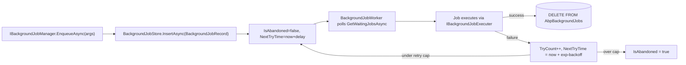

The Background Jobs module ships a single persisted aggregate: `BackgroundJobRecord`. It is the queue row consumed by the default polling worker (`BackgroundJobWorker`) when the host is configured with the database job manager.

Source path: `modules/background-jobs/src/Volo.Abp.BackgroundJobs.Domain/Volo/Abp/BackgroundJobs/BackgroundJobRecord.cs`.

## `BackgroundJobRecord`

Base: `AggregateRoot<Guid>` + `IHasCreationTime`.

```csharp
public class BackgroundJobRecord : AggregateRoot<Guid>, IHasCreationTime
{
    public virtual string JobName { get; set; }
    public virtual string JobArgs { get; set; }
    public virtual short TryCount { get; set; }
    public virtual DateTime CreationTime { get; set; }
    public virtual DateTime NextTryTime { get; set; }
    public virtual DateTime? LastTryTime { get; set; }
    public virtual bool IsAbandoned { get; set; }
    public virtual BackgroundJobPriority Priority { get; set; }

    protected BackgroundJobRecord() { }

    public BackgroundJobRecord(Guid id) : base(id) { }
}
```

### Properties

| Property        | Type                    | Notes                                                                                                |
| --------------- | ----------------------- | ---------------------------------------------------------------------------------------------------- |
| `Id`            | `Guid`                  | PK.                                                                                                  |
| `JobName`       | `string`                | `AssemblyQualifiedName` of the `IBackgroundJob` / `IAsyncBackgroundJob` type.                          |
| `JobArgs`       | `string`                | JSON-serialised arguments object (via `IBackgroundJobSerializer`).                                    |
| `TryCount`      | `short`                 | Number of attempts so far. Incremented on every failure.                                              |
| `CreationTime`  | `DateTime`              | From `IHasCreationTime`. Set when the row is enqueued.                                                |
| `NextTryTime`   | `DateTime`              | When the worker is allowed to pick the job up again. Polling skips rows where `NextTryTime > now`.    |
| `LastTryTime`   | `DateTime?`             | Most recent attempt. `null` until first execution.                                                    |
| `IsAbandoned`   | `bool`                  | Set when `TryCount` exceeds `AbpBackgroundJobOptions.JobExecutionTimeout` / max-retries policy.       |
| `Priority`      | `BackgroundJobPriority` | `Low`, `BelowNormal`, `Normal`, `AboveNormal`, `High`. The worker dequeues higher-priority rows first. |
| `ExtraProperties` | `ExtraPropertyDictionary` | Carries optional metadata; from `AggregateRoot`.                                                  |
| `ConcurrencyStamp` | `string`              | Optimistic-concurrency token; from `AggregateRoot`.                                                   |

### Indexes

- `IX_AbpBackgroundJobs_IsAbandoned_NextTryTime` — the hot path for the worker's polling query.
- Optional `Priority` filter applied at the `IBackgroundJobStore.GetWaitingJobsAsync` SQL level.

### Polling SQL (simplified)

```csharp
public Task<List<BackgroundJobRecord>> GetWaitingJobsAsync(int maxResultCount)
{
    return _repository
        .GetListAsync(x => !x.IsAbandoned && x.NextTryTime <= DateTime.Now)
        .ContinueWith(t => t.Result
            .OrderByDescending(x => x.Priority)
            .ThenBy(x => x.NextTryTime)
            .Take(maxResultCount)
            .ToList());
}
```

## `BackgroundJobPriority`

```csharp
public enum BackgroundJobPriority : byte
{
    Low = 5,
    BelowNormal = 10,
    Normal = 15,
    AboveNormal = 20,
    High = 25
}
```

The numeric gaps leave room for custom priorities without breaking serialised arguments.

## Lifecycle



The default backoff is `AbpBackgroundJobOptions.DefaultFirstWaitDuration * Math.Pow(WaitFactor, TryCount)` and is capped by `AbpBackgroundJobOptions.MaxWaitDuration`.

## Tables

| Entity                | Table                | Composite key |
| --------------------- | -------------------- | ------------- |
| `BackgroundJobRecord` | `AbpBackgroundJobs`  | `Id`          |

## Integration points

- `IBackgroundJobStore` is implemented by `BackgroundJobStore`, which delegates to `IBackgroundJobRepository`.
- `BackgroundJobWorker` is a periodic worker registered by `AbpBackgroundJobsModule` when `AbpBackgroundJobOptions.IsJobExecutionEnabled` is `true`.
- For RabbitMQ, Hangfire, Quartz, etc., the framework ships alternative `IBackgroundJobManager` implementations that **do not** touch `BackgroundJobRecord` — those backends maintain their own stores.

## See also

- [Background Jobs module](/modules/background-jobs-module)
- [Background-job execution flow](/flows/background-job-execution)
- [`Volo.Abp.BackgroundJobs`](/framework/background/volo-abp-background-jobs)
- [Entity base types](/reference/models/entities-base-types)
