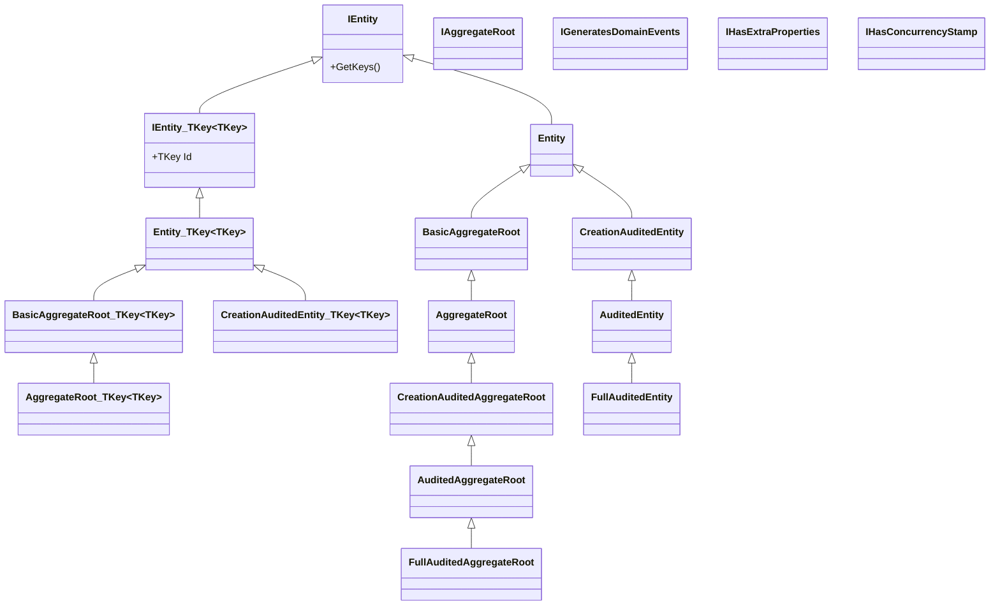

ABP's domain layer ships a small but precise hierarchy of base classes that every persistable type in the framework and its modules inherits from. They normalize four cross-cutting concerns — identity, domain events, auditing, and extensibility — so that repositories, the unit of work, audit interceptors and EF Core / MongoDB providers can treat any entity uniformly without reflection on attributes.

This page catalogues every entity base type defined under `framework/src/Volo.Abp.Ddd.Domain/Volo/Abp/Domain/Entities/` and the matching auditing contracts under `framework/src/Volo.Abp.Auditing.Contracts/Volo/Abp/Auditing/`. The order below mirrors the inheritance chain.

## Inheritance overview



## `IEntity` and `Entity`

`IEntity` is the root marker interface: it just exposes `GetKeys()` so that a composite-key entity can return all of its key components. `Entity` is the abstract default implementation and also performs the call to `EntityHelper.TrySetTenantId(this)` in its constructor — that single line is why every multi-tenant entity that derives from `Entity` automatically picks up `ICurrentTenant.Id` at construction time.

```csharp
[Serializable]
public abstract class Entity : IEntity
{
    protected Entity()
    {
        EntityHelper.TrySetTenantId(this);
    }

    public abstract object?[] GetKeys();

    public bool EntityEquals(IEntity other)
        => EntityHelper.EntityEquals(this, other);
}
```

### `Entity<TKey>`

The generic variant adds a strongly typed `Id` and a default `GetKeys()` implementation. It is the most common base for entities that use a single primary key column.

```csharp
public abstract class Entity<TKey> : Entity, IEntity<TKey>
{
    public virtual TKey Id { get; protected set; } = default!;
    public override object?[] GetKeys() => new object?[] { Id };
}
```

| Property | Type   | Notes                                                         |
| -------- | ------ | ------------------------------------------------------------- |
| `Id`     | `TKey` | Single primary key. Setter is `protected` to enforce factories. |

## `BasicAggregateRoot` / `BasicAggregateRoot<TKey>`

`BasicAggregateRoot` extends `Entity` and adds `IAggregateRoot` plus `IGeneratesDomainEvents`. It stores two private event buckets — local and distributed — and exposes them through `GetLocalEvents()` / `GetDistributedEvents()` and the matching `ClearLocalEvents()` / `ClearDistributedEvents()` operations. The unit-of-work middleware drains these buckets at save-changes time.

```csharp
public abstract class BasicAggregateRoot<TKey> : Entity<TKey>,
    IAggregateRoot<TKey>, IGeneratesDomainEvents
{
    protected virtual void AddLocalEvent(object eventData)
        => _localEvents.Add(new DomainEventRecord(eventData, EventOrderGenerator.GetNext()));

    protected virtual void AddDistributedEvent(object eventData)
        => _distributedEvents.Add(new DomainEventRecord(eventData, EventOrderGenerator.GetNext()));
}
```

Choose `BasicAggregateRoot<TKey>` for aggregates that do **not** need `ExtraProperties` (object-extension) or an EF Core `ConcurrencyStamp`. Examples in the framework: `PermissionDefinitionRecord`, `SettingDefinitionRecord`, `FeatureDefinitionRecord`, `IdentityLinkUser`, `IdentityUserDelegation`, `Rating`, `UserReaction`.

## `AggregateRoot` / `AggregateRoot<TKey>`

`AggregateRoot` is the most-used aggregate base. On top of `BasicAggregateRoot` it implements:

- `IHasExtraProperties` — an `ExtraPropertyDictionary ExtraProperties` bucket initialised with `SetDefaultsForExtraProperties()` so that the [object-extension manager](/framework/ddd/entities-and-aggregates) can attach declarations.
- `IHasConcurrencyStamp` — a `[DisableAuditing]`-marked `ConcurrencyStamp` string seeded with `Guid.NewGuid().ToString("N")` to power optimistic concurrency in EF Core mappings.
- A `Validate(ValidationContext)` method that delegates to `ExtensibleObjectValidator` so that extra properties participate in `IValidatableObject` flows.

```csharp
public abstract class AggregateRoot<TKey> : BasicAggregateRoot<TKey>,
    IHasExtraProperties, IHasConcurrencyStamp
{
    public virtual ExtraPropertyDictionary ExtraProperties { get; protected set; }

    [DisableAuditing]
    public virtual string ConcurrencyStamp { get; set; }

    protected AggregateRoot()
    {
        ConcurrencyStamp = Guid.NewGuid().ToString("N");
        ExtraProperties = new ExtraPropertyDictionary();
        this.SetDefaultsForExtraProperties();
    }
}
```

| Member             | Type                      | Purpose                                                            |
| ------------------ | ------------------------- | ------------------------------------------------------------------ |
| `Id`               | `TKey`                    | Primary key (inherited).                                           |
| `ExtraProperties`  | `ExtraPropertyDictionary` | Object-extension bucket; persisted as `ExtraProperties` JSON column. |
| `ConcurrencyStamp` | `string`                  | Optimistic-concurrency token regenerated on update.                 |

## Auditing entity bases

Auditing bases compose four orthogonal interfaces from `Volo.Abp.Auditing.Contracts`:

- `IHasCreationTime` → `DateTime CreationTime`
- `IMayHaveCreator` → `Guid? CreatorId`
- `IHasModificationTime` → `DateTime? LastModificationTime`
- `IModificationAuditedObject` → adds `Guid? LastModifierId`
- `IHasDeletionTime` (extends `ISoftDelete`) → `DateTime? DeletionTime` + `bool IsDeleted`
- `IDeletionAuditedObject` → adds `Guid? DeleterId`

Combining them produces three layers — *creation-audited*, *audited*, and *full-audited* — each with both an entity and aggregate-root variant.

### `CreationAuditedEntity` / `CreationAuditedEntity<TKey>`

```csharp
public abstract class CreationAuditedEntity<TKey> : Entity<TKey>, ICreationAuditedObject
{
    public virtual DateTime CreationTime { get; protected set; }
    public virtual Guid? CreatorId { get; protected set; }
}
```

| Property       | Type        | Set by                                          |
| -------------- | ----------- | ----------------------------------------------- |
| `CreationTime` | `DateTime`  | `AuditPropertySetter` on save (insert).         |
| `CreatorId`    | `Guid?`     | `AuditPropertySetter` from `ICurrentUser.Id`.   |

### `AuditedEntity` / `AuditedEntity<TKey>`

Adds modification audit on top of `CreationAuditedEntity`.

| Property               | Type        |
| ---------------------- | ----------- |
| `LastModificationTime` | `DateTime?` |
| `LastModifierId`       | `Guid?`     |

### `FullAuditedEntity` / `FullAuditedEntity<TKey>`

Adds soft-delete + deletion audit. Implements `IFullAuditedObject`.

```csharp
public abstract class FullAuditedEntity<TKey> : AuditedEntity<TKey>, IFullAuditedObject
{
    public virtual bool IsDeleted { get; set; }
    public virtual Guid? DeleterId { get; set; }
    public virtual DateTime? DeletionTime { get; set; }
}
```

`ISoftDelete` makes the EF Core / MongoDB query filters short-circuit reads that would otherwise return soft-deleted rows. The `IDataFilter<ISoftDelete>` ambient flag overrides the filter on demand.

### Aggregate-root counterparts

`CreationAuditedAggregateRoot<TKey>` → `AuditedAggregateRoot<TKey>` → `FullAuditedAggregateRoot<TKey>` mirror the entity hierarchy but derive from `AggregateRoot<TKey>` so they also carry `ExtraProperties` and `ConcurrencyStamp`. These are the bases used by every persisted aggregate in the official modules (Identity, Tenant Management, IdentityServer, OpenIddict, CMS Kit, …).

### Variants with user navigation

For each base above there is a `…WithUser` variant (for example `AuditedEntityWithUser<TUser>`) that exposes navigation properties `Creator`, `LastModifier`, `Deleter`. They are rarely used because most modules prefer the GUID-only form to avoid cross-aggregate references.

## Cross-cutting interfaces

These interfaces are usually combined with the bases above to opt into framework behaviours.

| Interface              | Property                  | Effect                                                                              |
| ---------------------- | ------------------------- | ----------------------------------------------------------------------------------- |
| `IMultiTenant`         | `Guid? TenantId`          | Activates tenant data filter; `EntityHelper.TrySetTenantId` populates on construction. |
| `ISoftDelete`          | `bool IsDeleted`          | Activates soft-delete filter; deletes are translated to `Update` by the UoW.        |
| `IHasCreationTime`     | `DateTime CreationTime`   | Set on insert by `AuditPropertySetter`.                                              |
| `IHasModificationTime` | `DateTime? LastModificationTime` | Set on update.                                                                  |
| `IHasExtraProperties`  | `ExtraPropertyDictionary` | Powers `ExtraProperties`, `SetProperty`, `GetProperty`.                              |
| `IHasConcurrencyStamp` | `string ConcurrencyStamp` | EF Core `[ConcurrencyCheck]` token rotated on update.                                |
| `IHasEntityVersion`    | `int EntityVersion`       | Optional row version counter — used by Identity user/role and CMS pages.            |
| `IMustHaveCreator`     | `Guid CreatorId`          | Asserts the creator is required (vs. `IMayHaveCreator`).                             |

### `IMultiTenant`

```csharp
public interface IMultiTenant
{
    Guid? TenantId { get; }
}
```

### `ISoftDelete`

```csharp
public interface ISoftDelete
{
    bool IsDeleted { get; }
}
```

### `IHasExtraProperties` and `IHasConcurrencyStamp`

```csharp
public interface IHasExtraProperties { ExtraPropertyDictionary ExtraProperties { get; } }
public interface IHasConcurrencyStamp { string ConcurrencyStamp { get; set; } }
```

## Choosing the right base

| Need                                                            | Use                                                                |
| --------------------------------------------------------------- | ------------------------------------------------------------------ |
| Value-object-like entity, no DI/events/audit                    | `Entity` or `Entity<TKey>`                                          |
| Aggregate root that publishes events but does not need extras    | `BasicAggregateRoot<TKey>`                                          |
| Aggregate root with extension props and optimistic concurrency   | `AggregateRoot<TKey>`                                               |
| Track who/when created                                          | `CreationAuditedEntity<TKey>` / `CreationAuditedAggregateRoot<TKey>` |
| Track creation + last modification                              | `AuditedEntity<TKey>` / `AuditedAggregateRoot<TKey>`                |
| Soft-delete and full audit trail                                | `FullAuditedEntity<TKey>` / `FullAuditedAggregateRoot<TKey>`        |
| Composite primary key                                           | `Entity` (non-generic) + override `GetKeys()`                       |

## How auditing is applied

The interceptor pipeline that populates these properties is documented in [Auditing flow](/flows/auditing-flow). The relevant component is `AuditPropertySetter` (in `framework/src/Volo.Abp.Auditing/Volo/Abp/Auditing/`), which is invoked by `AbpDbContext` and by `IUnitOfWork.SaveChangesAsync()`.

## See also

- [`Volo.Abp.Domain` package](/framework/ddd/domain)
- [Auditing flow](/flows/auditing-flow)
- [Object Extension Manager](/framework/ddd/entities-and-aggregates)
- [Multi-tenancy resolution](/flows/multi-tenancy-resolution)
- [Auditing entities](/reference/models/auditing-entities)
