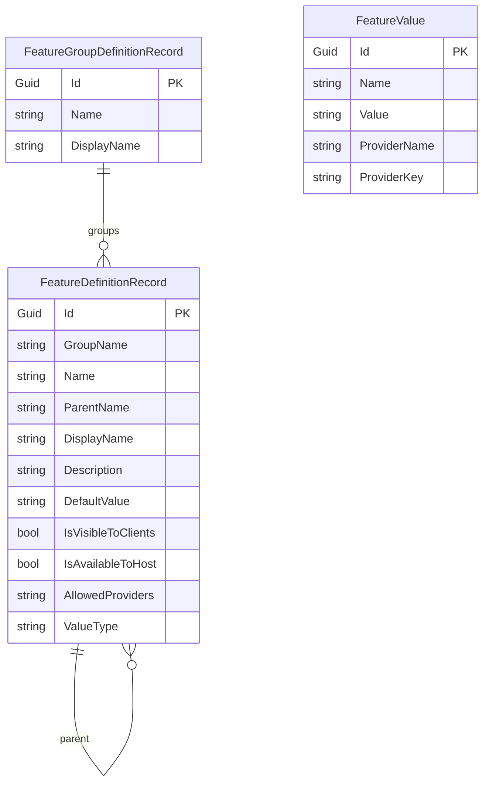

Feature Management persists tenant/edition feature toggles and a serialized form of the feature catalogue. The pattern parallels [Permission Management](/reference/models/permission-management-entities) and [Setting Management](/reference/models/setting-management-entities): runtime values live in `FeatureValue`, design-time metadata in `FeatureDefinitionRecord` / `FeatureGroupDefinitionRecord`.

Source path: `modules/feature-management/src/Volo.Abp.FeatureManagement.Domain/Volo/Abp/FeatureManagement/`.

## Overview



## `FeatureValue`

Base: `Entity<Guid>` + `IAggregateRoot<Guid>`. A single grant row: "feature `Name` has value `Value` for provider `ProviderName`/`ProviderKey`".

```csharp
public class FeatureValue : Entity<Guid>, IAggregateRoot<Guid>
{
    [NotNull] public virtual string Name { get; protected set; }
    [NotNull] public virtual string Value { get; internal set; }
    [NotNull] public virtual string ProviderName { get; protected set; }
    [CanBeNull] public virtual string ProviderKey { get; protected set; }

    public FeatureValue(Guid id, string name, string value, string providerName, string providerKey)
    {
        Id = id;
        Name = Check.NotNullOrWhiteSpace(name, nameof(name));
        Value = Check.NotNullOrWhiteSpace(value, nameof(value));
        ProviderName = Check.NotNullOrWhiteSpace(providerName, nameof(providerName));
        ProviderKey = providerKey;
    }
}
```

| Property        | Type     | Notes                                                              |
| --------------- | -------- | ------------------------------------------------------------------ |
| `Id`            | `Guid`   | PK                                                                  |
| `Name`          | `string` | Feature definition name (e.g. `SaasService.EnableBilling`).        |
| `Value`         | `string` | Stringified value — `"true"`, integers, JSON, …                    |
| `ProviderName`  | `string` | `"E"` (edition), `"T"` (tenant), `"D"` (default), `"H"` (host).    |
| `ProviderKey`   | `string` | Identity of the scope. Null for host/default.                      |

### Indexes

- `UNIQUE (Name, ProviderName, ProviderKey)`

### Value types

The interpretation of `Value` is dictated by the corresponding `FeatureDefinitionRecord.ValueType` — `ToggleStringValueType`, `FreeTextStringValueType`, or `SelectionStringValueType`. The framework's `IStringValueType` registry decodes the value at read time.

## `FeatureDefinitionRecord`

Base: `BasicAggregateRoot<Guid>` + `IHasExtraProperties`.

```csharp
public class FeatureDefinitionRecord : BasicAggregateRoot<Guid>, IHasExtraProperties
{
    public string GroupName { get; set; }
    public string Name { get; set; }
    public string ParentName { get; set; }
    public string DisplayName { get; set; }
    public string Description { get; set; }
    public string DefaultValue { get; set; }
    public bool IsVisibleToClients { get; set; }
    public bool IsAvailableToHost { get; set; }
    public string AllowedProviders { get; set; }
    public string ValueType { get; set; }  // ToggleStringValueType, …
    public ExtraPropertyDictionary ExtraProperties { get; protected set; }
}
```

| Property             | Type     | Constraints (`FeatureDefinitionRecordConsts`)                 | Notes                                                              |
| -------------------- | -------- | -------------------------------------------------------------- | ------------------------------------------------------------------ |
| `GroupName`          | `string` | `MaxNameLength` (128)                                          | FK by name to `FeatureGroupDefinitionRecord.Name`.                |
| `Name`               | `string` | `MaxNameLength` (128)                                          | Unique within group.                                               |
| `ParentName`         | `string` | `MaxNameLength` (128), optional                                | Parent feature name for hierarchy.                                 |
| `DisplayName`        | `string` | `MaxDisplayNameLength` (256)                                   |                                                                    |
| `Description`        | `string` | `MaxDescriptionLength` (256)                                   |                                                                    |
| `DefaultValue`       | `string` | `MaxDefaultValueLength` (256)                                  | Fallback when no provider matches.                                 |
| `IsVisibleToClients` | `bool`   | Default `true`                                                 | When true, the feature is visible to remote clients.               |
| `IsAvailableToHost`  | `bool`   | Default `true`                                                 | When true, the host can also grant the feature.                    |
| `AllowedProviders`   | `string` | `MaxAllowedProvidersLength` (128)                              | Comma-separated provider names.                                    |
| `ValueType`          | `string` | `MaxValueTypeLength`                                           | Serialized `IStringValueType` info.                                 |
| `ExtraProperties`    | `ExtraPropertyDictionary` | —                                                  | Object-extension bucket.                                            |

### Drift detection

Like `PermissionDefinitionRecord`, `FeatureDefinitionRecord` exposes `HasSameData` and `Patch` so that `StaticFeatureSaver` can reconcile in-memory definitions with the database without producing spurious updates. Extra properties participate in the comparison via `HasSameExtraProperties`.

## `FeatureGroupDefinitionRecord`

```csharp
public class FeatureGroupDefinitionRecord : BasicAggregateRoot<Guid>, IHasExtraProperties
{
    public string Name { get; set; }
    public string DisplayName { get; set; }
    public ExtraPropertyDictionary ExtraProperties { get; protected set; }
}
```

| Property      | Type     | Constraints (`FeatureGroupDefinitionRecordConsts`) |
| ------------- | -------- | -------------------------------------------------- |
| `Name`        | `string` | `MaxNameLength` (128), unique                       |
| `DisplayName` | `string` | `MaxDisplayNameLength` (256)                        |

## Tables and indexes

| Entity                          | Table                          | Notable indexes                          |
| ------------------------------- | ------------------------------ | ---------------------------------------- |
| `FeatureValue`                  | `AbpFeatureValues`             | `UNIQUE (Name, ProviderName, ProviderKey)` |
| `FeatureDefinitionRecord`       | `AbpFeatures`                  | `UNIQUE (GroupName, Name)`               |
| `FeatureGroupDefinitionRecord`  | `AbpFeatureGroups`             | `UNIQUE (Name)`                          |

## Integration points

- `FeatureManagementStore` reads `FeatureValue` rows via `IFeatureManagementStore`, caches via `FeatureValueCacheItem`, invalidated by `FeatureValueCacheItemInvalidator`.
- Built-in providers: `DefaultValueFeatureManagementProvider`, `EditionFeatureManagementProvider`. The Tenant Management module adds `TenantFeatureManagementProvider`.
- `DynamicFeatureDefinitionStore` rehydrates `FeatureDefinitionRecord` into runtime `FeatureDefinition`s for distributed setups.

## See also

- [Feature Management module](/modules/feature-management)
- [`Volo.Abp.Features`](/framework/features/volo-abp-features)
- [Permission Management entities](/reference/models/permission-management-entities)
- [Setting Management entities](/reference/models/setting-management-entities)
