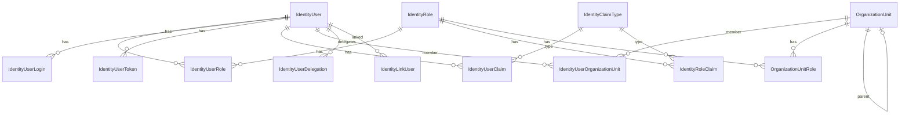

The Identity module is the largest entity surface in ABP. Its domain layer (`modules/identity/src/Volo.Abp.Identity.Domain/Volo/Abp/Identity/`) defines two big aggregates — `IdentityUser` and `IdentityRole` — plus claim-type metadata, organization-unit hierarchy, security audit, and impersonation linking. This page enumerates every persisted type and maps its relationships.

## Entity relationship overview



## `IdentityUser`

Base: `FullAuditedAggregateRoot<Guid>` + `IUser`, `IHasEntityVersion`.

```csharp
public class IdentityUser : FullAuditedAggregateRoot<Guid>, IUser, IHasEntityVersion
{
    public virtual Guid? TenantId { get; protected set; }
    public virtual string UserName { get; protected internal set; }
    [DisableAuditing] public virtual string NormalizedUserName { get; protected internal set; }
    public virtual string Name { get; set; }
    public virtual string Surname { get; set; }
    public virtual string Email { get; protected internal set; }
    [DisableAuditing] public virtual string NormalizedEmail { get; protected internal set; }
    public virtual bool EmailConfirmed { get; protected internal set; }
    [DisableAuditing] public virtual string PasswordHash { get; protected internal set; }
    [DisableAuditing] public virtual string SecurityStamp { get; protected internal set; }
    public virtual bool IsExternal { get; set; }
    public virtual string PhoneNumber { get; protected internal set; }
    public virtual bool PhoneNumberConfirmed { get; protected internal set; }
    public virtual bool IsActive { get; protected internal set; }
    public virtual bool TwoFactorEnabled { get; protected internal set; }
    public virtual DateTimeOffset? LockoutEnd { get; protected internal set; }
    public virtual bool LockoutEnabled { get; protected internal set; }
    public virtual int AccessFailedCount { get; protected internal set; }
    public virtual bool ShouldChangePasswordOnNextLogin { get; protected internal set; }
    public virtual int EntityVersion { get; protected set; }
    public virtual DateTimeOffset? LastPasswordChangeTime { get; protected set; }

    public virtual ICollection<IdentityUserRole> Roles { get; protected set; }
    public virtual ICollection<IdentityUserClaim> Claims { get; protected set; }
    public virtual ICollection<IdentityUserLogin> Logins { get; protected set; }
    public virtual ICollection<IdentityUserToken> Tokens { get; protected set; }
    public virtual ICollection<IdentityUserOrganizationUnit> OrganizationUnits { get; protected set; }
}
```

### Properties

| Property                          | Type                | Notes                                                                       |
| --------------------------------- | ------------------- | --------------------------------------------------------------------------- |
| `Id`                              | `Guid`              | Primary key.                                                                |
| `TenantId`                        | `Guid?`             | `IMultiTenant`. Indexed.                                                    |
| `UserName` / `NormalizedUserName` | `string`            | Unique per tenant. `NormalizedUserName` is `[DisableAuditing]`.             |
| `Email` / `NormalizedEmail`       | `string`            | Unique per tenant.                                                          |
| `EmailConfirmed`                  | `bool`              | Email confirmation flag.                                                    |
| `PasswordHash`                    | `string`            | `[DisableAuditing]` to keep secrets out of the audit log.                   |
| `SecurityStamp`                   | `string`            | `[DisableAuditing]`. Invalidates cookies when changed.                      |
| `IsExternal`                      | `bool`              | True for users created via external login.                                  |
| `PhoneNumber*`                    | `string`/`bool`     | Phone + confirmation flag.                                                  |
| `IsActive`                        | `bool`              | Disabling blocks login.                                                     |
| `TwoFactorEnabled`                | `bool`              | Enables 2FA flow.                                                           |
| `LockoutEnd` / `LockoutEnabled`   | `DateTimeOffset?` / `bool` | Account-lockout policy.                                              |
| `AccessFailedCount`               | `int`               | Resets on successful login.                                                 |
| `ShouldChangePasswordOnNextLogin` | `bool`              | Enforced by login validators.                                               |
| `EntityVersion`                   | `int`               | `IHasEntityVersion` — bumped on every change.                               |
| `LastPasswordChangeTime`          | `DateTimeOffset?`   | Updated by `ChangePasswordAsync`.                                            |
| `Roles`                           | `IdentityUserRole[]`| Owned link table.                                                            |
| `Claims`                          | `IdentityUserClaim[]` | Owned set.                                                                |
| `Logins`                          | `IdentityUserLogin[]` | External provider logins.                                                 |
| `Tokens`                          | `IdentityUserToken[]` | Auth tokens (2FA, recovery, …).                                            |
| `OrganizationUnits`               | `IdentityUserOrganizationUnit[]` | OU memberships.                                                |

### Indexes (EF mappings)

- `UNIQUE (TenantId, NormalizedUserName)`
- `UNIQUE (TenantId, NormalizedEmail)` (filtered to non-null email)
- Index on `NormalizedUserName`, `NormalizedEmail`

## `IdentityRole`

Base: `AggregateRoot<Guid>` (no audit) + `IMultiTenant`, `IHasEntityVersion`.

```csharp
public class IdentityRole : AggregateRoot<Guid>, IMultiTenant, IHasEntityVersion
{
    public virtual Guid? TenantId { get; protected set; }
    public virtual string Name { get; protected internal set; }
    [DisableAuditing] public virtual string NormalizedName { get; protected internal set; }
    public virtual ICollection<IdentityRoleClaim> Claims { get; protected set; }
    public virtual bool IsDefault { get; set; }
    public virtual bool IsStatic { get; set; }
    public virtual bool IsPublic { get; set; }
    public virtual int EntityVersion { get; protected set; }
}
```

| Property        | Type             | Notes                                              |
| --------------- | ---------------- | -------------------------------------------------- |
| `TenantId`      | `Guid?`          | Multi-tenant filter.                                |
| `Name`          | `string`         | Display name.                                      |
| `NormalizedName`| `string`         | `[DisableAuditing]`. Index target.                  |
| `IsDefault`     | `bool`           | Auto-assigned to every new user.                    |
| `IsStatic`      | `bool`           | Cannot be deleted or renamed via UI.                 |
| `IsPublic`      | `bool`           | Visible across users.                                |
| `EntityVersion` | `int`            | Bumped on change.                                   |
| `Claims`        | `IdentityRoleClaim[]` | Owned set.                                      |

## `IdentityClaim` (abstract) and concrete subtypes

```csharp
public abstract class IdentityClaim : Entity<Guid>, IMultiTenant
{
    public virtual Guid? TenantId { get; protected set; }
    public virtual string ClaimType { get; protected set; }
    public virtual string ClaimValue { get; protected set; }
}
```

| Concrete class      | Adds         | Base table       |
| ------------------- | ------------ | ---------------- |
| `IdentityUserClaim` | `Guid UserId` | `AbpUserClaims`  |
| `IdentityRoleClaim` | `Guid RoleId` | `AbpRoleClaims`  |

```csharp
public class IdentityUserClaim : IdentityClaim
{
    public virtual Guid UserId { get; protected set; }
}
```

`ToClaim()` projects an entity into a `System.Security.Claims.Claim` for ASP.NET Core integration.

## `IdentityClaimType`

Base: `AggregateRoot<Guid>`. Declares which claim types exist and validation metadata for them.

```csharp
public class IdentityClaimType : AggregateRoot<Guid>
{
    public virtual string Name { get; protected set; }
    public virtual bool Required { get; set; }
    public virtual bool IsStatic { get; protected set; }
    public virtual string Regex { get; set; }
    public virtual string RegexDescription { get; set; }
    public virtual string Description { get; set; }
    public virtual IdentityClaimValueType ValueType { get; set; }
}
```

`IdentityClaimValueType` enum: `String`, `Int`, `Boolean`, `DateTime`.

## Link entities (composite keys)

### `IdentityUserRole`

```csharp
public class IdentityUserRole : Entity, IMultiTenant
{
    public virtual Guid? TenantId { get; protected set; }
    public virtual Guid UserId { get; protected set; }
    public virtual Guid RoleId { get; protected set; }
    public override object[] GetKeys() => new object[] { UserId, RoleId };
}
```

### `IdentityUserLogin`

```csharp
public class IdentityUserLogin : Entity, IMultiTenant
{
    public virtual Guid? TenantId { get; protected set; }
    public virtual Guid UserId { get; protected set; }
    public virtual string LoginProvider { get; protected set; }
    public virtual string ProviderKey { get; protected set; }
    public virtual string ProviderDisplayName { get; protected set; }
    public override object[] GetKeys() => new object[] { UserId, LoginProvider };
}
```

### `IdentityUserToken`

```csharp
public class IdentityUserToken : Entity, IMultiTenant
{
    public virtual Guid? TenantId { get; protected set; }
    public virtual Guid UserId { get; protected set; }
    public virtual string LoginProvider { get; protected set; }
    public virtual string Name { get; protected set; }
    public virtual string Value { get; set; }
    public override object[] GetKeys() => new object[] { UserId, LoginProvider, Name };
}
```

## Organization units

### `OrganizationUnit`

Base: `FullAuditedAggregateRoot<Guid>` + `IMultiTenant`, `IHasEntityVersion`. Hierarchical via the `Code` materialized-path pattern.

```csharp
public class OrganizationUnit : FullAuditedAggregateRoot<Guid>, IMultiTenant, IHasEntityVersion
{
    public virtual Guid? TenantId { get; protected set; }
    public virtual Guid? ParentId { get; internal set; }
    public virtual string Code { get; internal set; }
    public virtual string DisplayName { get; set; }
    public virtual int EntityVersion { get; set; }
    public virtual ICollection<OrganizationUnitRole> Roles { get; protected set; }
}
```

- `Code` is a dot-separated zero-padded path (`"00001.00042.00005"`) generated by `OrganizationUnit.CreateCode(params int[])`.
- `ParentId` self-references the OU tree.

### `IdentityUserOrganizationUnit`

```csharp
public class IdentityUserOrganizationUnit : CreationAuditedEntity, IMultiTenant
{
    public virtual Guid? TenantId { get; protected set; }
    public virtual Guid UserId { get; protected set; }
    public virtual Guid OrganizationUnitId { get; protected set; }
    public override object[] GetKeys() => new object[] { UserId, OrganizationUnitId };
}
```

### `OrganizationUnitRole`

```csharp
public class OrganizationUnitRole : CreationAuditedEntity, IMultiTenant
{
    public virtual Guid? TenantId { get; protected set; }
    public virtual Guid RoleId { get; protected set; }
    public virtual Guid OrganizationUnitId { get; protected set; }
    public override object[] GetKeys() => new object[] { OrganizationUnitId, RoleId };
}
```

## `IdentitySecurityLog`

Base: `AggregateRoot<Guid>` + `IMultiTenant`. Append-only structured log of security-relevant events (login, logout, password change, …) — fed by `ISecurityLogManager`.

```csharp
public class IdentitySecurityLog : AggregateRoot<Guid>, IMultiTenant
{
    public Guid? TenantId { get; protected set; }
    public string ApplicationName { get; protected set; }
    public string Identity { get; protected set; }
    public string Action { get; protected set; }
    public Guid? UserId { get; protected set; }
    public string UserName { get; protected set; }
    public string TenantName { get; protected set; }
    public string ClientId { get; protected set; }
    public string CorrelationId { get; protected set; }
    public string ClientIpAddress { get; protected set; }
    public string BrowserInfo { get; protected set; }
    public DateTime CreationTime { get; protected set; }
}
```

All string lengths are clamped by `IdentitySecurityLogConsts.*Length`.

## `IdentityLinkUser` and `IdentityUserDelegation`

Both descend from `BasicAggregateRoot<Guid>` and represent cross-tenant user operations.

### `IdentityLinkUser`

Links two user identities across tenants so that they can switch contexts without re-login.

```csharp
public class IdentityLinkUser : BasicAggregateRoot<Guid>
{
    public virtual Guid SourceUserId { get; protected set; }
    public virtual Guid? SourceTenantId { get; protected set; }
    public virtual Guid TargetUserId { get; protected set; }
    public virtual Guid? TargetTenantId { get; protected set; }
}
```

### `IdentityUserDelegation`

Records a time-bounded delegation from one user to another.

```csharp
public class IdentityUserDelegation : BasicAggregateRoot<Guid>, IMultiTenant
{
    public virtual Guid? TenantId { get; protected set; }
    public virtual Guid SourceUserId { get; protected set; }
    public virtual Guid TargetUserId { get; protected set; }
    public virtual DateTime StartTime { get; protected set; }
    public virtual DateTime EndTime { get; protected set; }
}
```

## Index / table mapping

| Entity                          | Table                       | Composite key                                |
| ------------------------------- | --------------------------- | -------------------------------------------- |
| `IdentityUser`                  | `AbpUsers`                  | `Id`                                          |
| `IdentityRole`                  | `AbpRoles`                  | `Id`                                          |
| `IdentityUserRole`              | `AbpUserRoles`              | `(UserId, RoleId)`                            |
| `IdentityUserClaim`             | `AbpUserClaims`             | `Id`                                          |
| `IdentityRoleClaim`             | `AbpRoleClaims`             | `Id`                                          |
| `IdentityUserLogin`             | `AbpUserLogins`             | `(UserId, LoginProvider)`                     |
| `IdentityUserToken`             | `AbpUserTokens`             | `(UserId, LoginProvider, Name)`               |
| `IdentityClaimType`             | `AbpClaimTypes`             | `Id`                                          |
| `OrganizationUnit`              | `AbpOrganizationUnits`      | `Id`                                          |
| `OrganizationUnitRole`          | `AbpOrganizationUnitRoles`  | `(OrganizationUnitId, RoleId)`                |
| `IdentityUserOrganizationUnit`  | `AbpUserOrganizationUnits`  | `(UserId, OrganizationUnitId)`                |
| `IdentityLinkUser`              | `AbpLinkUsers`              | `Id`                                          |
| `IdentityUserDelegation`        | `AbpUserDelegations`        | `Id`                                          |
| `IdentitySecurityLog`           | `AbpSecurityLogs`           | `Id`                                          |

## See also

- [Identity module](/modules/identity)
- [Auditing entity bases](/reference/models/auditing-entities)
- [Entity base types](/reference/models/entities-base-types)
- [Audit-logging entities](/reference/models/audit-logging-entities) (separate module, structured request-level logging)
