The IdentityServer module wraps the IdentityServer4 data model in ABP aggregates. The five aggregate roots — `Client`, `ApiResource`, `ApiScope`, `IdentityResource`, `PersistedGrant`, and `DeviceFlowCodes` — own a small fleet of value entities (`ClientScope`, `ApiResourceSecret`, …) that flatten the IdentityServer4 configuration model into rows.

Source path: `modules/identityserver/src/Volo.Abp.IdentityServer.Domain/Volo/Abp/IdentityServer/`.

<Note>
For new applications, ABP now recommends the [OpenIddict module](/reference/models/openiddict-entities) instead of this one. The IdentityServer module is still maintained for existing deployments.
</Note>

## Aggregate map

```mermaid
erDiagram
    Client ||--o{ ClientGrantType : has
    Client ||--o{ ClientRedirectUri : has
    Client ||--o{ ClientPostLogoutRedirectUri : has
    Client ||--o{ ClientScope : has
    Client ||--o{ ClientSecret : has
    Client ||--o{ ClientClaim : has
    Client ||--o{ ClientIdPRestriction : has
    Client ||--o{ ClientCorsOrigin : has
    Client ||--o{ ClientProperty : has

    ApiResource ||--o{ ApiResourceSecret : has
    ApiResource ||--o{ ApiResourceScope : has
    ApiResource ||--o{ ApiResourceClaim : has
    ApiResource ||--o{ ApiResourceProperty : has

    ApiScope ||--o{ ApiScopeClaim : has
    ApiScope ||--o{ ApiScopeProperty : has

    IdentityResource ||--o{ IdentityResourceClaim : has
    IdentityResource ||--o{ IdentityResourceProperty : has
```



## `Client`

Base: `FullAuditedAggregateRoot<Guid>`. Mirrors the IdentityServer4 `Client` configuration object.

```csharp
public class Client : FullAuditedAggregateRoot<Guid>
{
    public virtual string ClientId { get; set; }
    public virtual string ClientName { get; set; }
    public virtual string Description { get; set; }
    public virtual string ClientUri { get; set; }
    public virtual string LogoUri { get; set; }
    public virtual bool Enabled { get; set; } = true;
    public virtual string ProtocolType { get; set; }
    public virtual bool RequireClientSecret { get; set; }
    public virtual bool RequireConsent { get; set; }
    public virtual bool AllowRememberConsent { get; set; }
    public virtual bool AlwaysIncludeUserClaimsInIdToken { get; set; }
    public virtual bool RequirePkce { get; set; }
    public virtual bool AllowPlainTextPkce { get; set; }
    public virtual bool RequireRequestObject { get; set; }
    public virtual bool AllowAccessTokensViaBrowser { get; set; }
    public virtual string FrontChannelLogoutUri { get; set; }
    public virtual bool FrontChannelLogoutSessionRequired { get; set; }
    public virtual string BackChannelLogoutUri { get; set; }
    public virtual bool BackChannelLogoutSessionRequired { get; set; }
    public virtual bool AllowOfflineAccess { get; set; }
    public virtual int IdentityTokenLifetime { get; set; }
    public virtual string AllowedIdentityTokenSigningAlgorithms { get; set; }
    public virtual int AccessTokenLifetime { get; set; }
    public virtual int AuthorizationCodeLifetime { get; set; }
    public virtual int? ConsentLifetime { get; set; }
    public virtual int AbsoluteRefreshTokenLifetime { get; set; }
    public virtual int SlidingRefreshTokenLifetime { get; set; }
    public virtual int RefreshTokenUsage { get; set; }
    public virtual bool UpdateAccessTokenClaimsOnRefresh { get; set; }
    public virtual int RefreshTokenExpiration { get; set; }
    public virtual int AccessTokenType { get; set; }
    public virtual bool EnableLocalLogin { get; set; }
    public virtual bool IncludeJwtId { get; set; }
    public virtual bool AlwaysSendClientClaims { get; set; }
    // … plus the owned collections listed below
}
```

### Owned collections

| Collection                                | Element type                    | Composite key on element             |
| ----------------------------------------- | ------------------------------- | ------------------------------------ |
| `AllowedGrantTypes`                       | `ClientGrantType`               | `(ClientId, GrantType)`              |
| `RedirectUris`                            | `ClientRedirectUri`             | `(ClientId, RedirectUri)`            |
| `PostLogoutRedirectUris`                  | `ClientPostLogoutRedirectUri`   | `(ClientId, PostLogoutRedirectUri)`  |
| `AllowedScopes`                           | `ClientScope`                   | `(ClientId, Scope)`                  |
| `ClientSecrets`                           | `ClientSecret`                  | `Id` (extends `Secret`)               |
| `Claims`                                  | `ClientClaim`                   | `(ClientId, Type, Value)`            |
| `IdentityProviderRestrictions`            | `ClientIdPRestriction`          | `(ClientId, Provider)`               |
| `AllowedCorsOrigins`                      | `ClientCorsOrigin`              | `(ClientId, Origin)`                 |
| `Properties`                              | `ClientProperty`                | `(ClientId, Key, Value)`             |

Each element class is a plain `Entity` with `ClientId` as part of its composite key, except `ClientSecret` which extends `Secret`:

```csharp
public abstract class Secret : Entity
{
    public virtual string Type { get; protected set; }
    public virtual string Value { get; set; }
    public virtual string Description { get; set; }
    public virtual DateTime? Expiration { get; set; }
}
```

## `ApiResource`

Base: `FullAuditedAggregateRoot<Guid>`. Represents an API the IdentityServer protects.

```csharp
public class ApiResource : FullAuditedAggregateRoot<Guid>
{
    [NotNull] public virtual string Name { get; protected set; }
    public virtual string DisplayName { get; set; }
    public virtual string Description { get; set; }
    public virtual bool Enabled { get; set; }
    public virtual string AllowedAccessTokenSigningAlgorithms { get; set; }
    public virtual bool ShowInDiscoveryDocument { get; set; } = true;
    public virtual List<ApiResourceSecret> Secrets { get; protected set; }
    public virtual List<ApiResourceScope> Scopes { get; protected set; }
    public virtual List<ApiResourceClaim> UserClaims { get; protected set; }
    public virtual List<ApiResourceProperty> Properties { get; protected set; }
}
```

| Owned entity        | Notes                                             |
| ------------------- | ------------------------------------------------- |
| `ApiResourceSecret` | Subclass of `Secret`. `Type` defaults to `SharedSecret`. |
| `ApiResourceScope`  | Maps the resource to one or more `ApiScope.Name`. |
| `ApiResourceClaim`  | Subclass of `UserClaim`. The claim type the API needs. |
| `ApiResourceProperty` | Free-form `(Key, Value)` extensibility bag.    |

When created, the constructor seeds `Scopes` with an `ApiResourceScope` named after the resource itself — a common IdentityServer convention.

## `ApiScope`

Base: `FullAuditedAggregateRoot<Guid>`. The "scope" granted in access tokens.

```csharp
public class ApiScope : FullAuditedAggregateRoot<Guid>
{
    public virtual bool Enabled { get; set; }
    [NotNull] public virtual string Name { get; protected set; }
    public virtual string DisplayName { get; set; }
    public virtual string Description { get; set; }
    public virtual bool Required { get; set; }
    public virtual bool Emphasize { get; set; }
    public virtual bool ShowInDiscoveryDocument { get; set; }
    public virtual List<ApiScopeClaim> UserClaims { get; protected set; }
    public virtual List<ApiScopeProperty> Properties { get; protected set; }
}
```

| Owned entity         | Composite key       |
| -------------------- | ------------------- |
| `ApiScopeClaim`      | `(ApiScopeId, Type)` |
| `ApiScopeProperty`   | `(ApiScopeId, Key, Value)` |

## `IdentityResource`

Base: `FullAuditedAggregateRoot<Guid>`. Represents identity claims requested via `openid`, `profile`, custom resources, …

```csharp
public class IdentityResource : FullAuditedAggregateRoot<Guid>
{
    public virtual string Name { get; set; }
    public virtual string DisplayName { get; set; }
    public virtual string Description { get; set; }
    public virtual bool Enabled { get; set; }
    public virtual bool Required { get; set; }
    public virtual bool Emphasize { get; set; }
    public virtual bool ShowInDiscoveryDocument { get; set; }
    public virtual List<IdentityResourceClaim> UserClaims { get; set; }
    public virtual List<IdentityResourceProperty> Properties { get; set; }
}
```

The constructor that accepts an `IdentityServer4.Models.IdentityResource` projects the in-memory model into the aggregate, populating `UserClaims` and `Properties` in one pass.

## `PersistedGrant`

Base: `AggregateRoot<Guid>`. The persistent store row for refresh tokens, reference tokens, authorisation codes, consent grants, …

```csharp
public class PersistedGrant : AggregateRoot<Guid>
{
    public virtual string Key { get; set; }
    public virtual string Type { get; set; }
    public virtual string SubjectId { get; set; }
    public virtual string SessionId { get; set; }
    public virtual string ClientId { get; set; }
    public virtual string Description { get; set; }
    public virtual DateTime CreationTime { get; set; }
    public virtual DateTime? Expiration { get; set; }
    public virtual DateTime? ConsumedTime { get; set; }
    public virtual string Data { get; set; }
}
```

| Property        | Type        | Notes                                       |
| --------------- | ----------- | ------------------------------------------- |
| `Key`           | `string`    | The IdentityServer key — unique per grant.  |
| `Type`          | `string`    | `refresh_token`, `reference_token`, …       |
| `SubjectId`     | `string`    | User id (string).                           |
| `SessionId`     | `string`    | OIDC session id.                            |
| `ClientId`      | `string`    | Issuing client.                             |
| `CreationTime`  | `DateTime`  | Issue time.                                 |
| `Expiration`    | `DateTime?` | Absolute expiry.                            |
| `ConsumedTime`  | `DateTime?` | Set when the grant is single-use consumed.  |
| `Data`          | `string`    | Serialised payload understood by IS4.       |

### Indexes

- `UNIQUE (Key)`
- `(SubjectId, ClientId, Type)`
- `(SubjectId, SessionId, Type)`

## `DeviceFlowCodes`

Base: `CreationAuditedAggregateRoot<Guid>`. Stores user-code / device-code pairs for OAuth Device Flow.

```csharp
public class DeviceFlowCodes : CreationAuditedAggregateRoot<Guid>
{
    public virtual string DeviceCode { get; set; }
    public virtual string UserCode { get; set; }
    public virtual string SubjectId { get; set; }
    public virtual string SessionId { get; set; }
    public virtual string ClientId { get; set; }
    public virtual string Description { get; set; }
    public virtual DateTime? Expiration { get; set; }
    public virtual string Data { get; set; }
}
```

### Indexes

- `UNIQUE (DeviceCode)`
- `UNIQUE (UserCode)`

## Tables

| Entity              | Table                       |
| ------------------- | --------------------------- |
| `Client`            | `IdentityServerClients`     |
| `ApiResource`       | `IdentityServerApiResources`|
| `ApiScope`          | `IdentityServerApiScopes`   |
| `IdentityResource`  | `IdentityServerIdentityResources` |
| `PersistedGrant`    | `IdentityServerPersistedGrants` |
| `DeviceFlowCodes`   | `IdentityServerDeviceFlowCodes` |

Each owned collection has its own child table (`IdentityServerClientGrantTypes`, `IdentityServerApiResourceSecrets`, …).

## See also

- [IdentityServer module](/modules/authservers)
- [OpenIddict entities](/reference/models/openiddict-entities) (newer alternative)
- [Auditing entity bases](/reference/models/auditing-entities)
- [Entity base types](/reference/models/entities-base-types)
