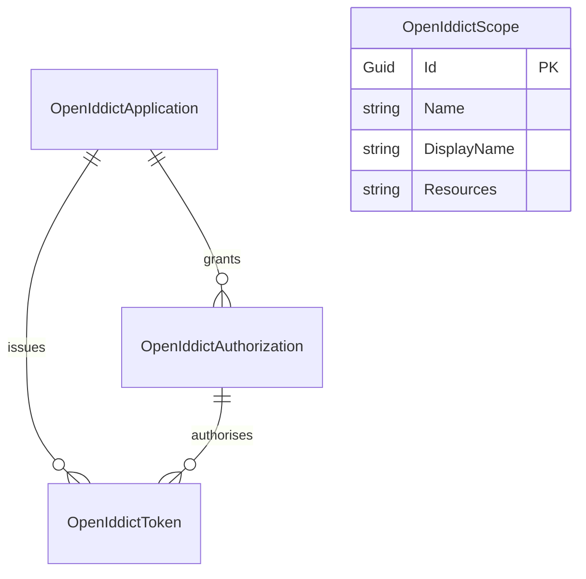

The OpenIddict module is ABP's recommended OpenID Connect server implementation. Its data model is intentionally flat: four `FullAuditedAggregateRoot<Guid>` aggregates that mirror the OpenIddict abstractions one-to-one. There are no owned collections — collection-shaped fields are serialised to JSON strings, which keeps schema migrations trivial and matches OpenIddict's reference EF Core schema.

Source path: `modules/openiddict/src/Volo.Abp.OpenIddict.Domain/Volo/Abp/OpenIddict/`.

## Aggregate map



## `OpenIddictApplication`

Base: `FullAuditedAggregateRoot<Guid>`. The "client" in OAuth/OIDC terms.

```csharp
public class OpenIddictApplication : FullAuditedAggregateRoot<Guid>
{
    public virtual string ClientId { get; set; }
    public virtual string ClientSecret { get; set; }
    public virtual string ConsentType { get; set; }
    public virtual string DisplayName { get; set; }
    public virtual string DisplayNames { get; set; }
    public virtual string Permissions { get; set; }
    public virtual string PostLogoutRedirectUris { get; set; }
    public virtual string Properties { get; set; }
    public virtual string RedirectUris { get; set; }
    public virtual string Requirements { get; set; }
    public virtual string Type { get; set; }
    public string ClientUri { get; set; }
    public string LogoUri { get; set; }
}
```

### Properties

| Property                  | Type     | Format                                                              | Notes                                                                                              |
| ------------------------- | -------- | ------------------------------------------------------------------- | -------------------------------------------------------------------------------------------------- |
| `Id`                      | `Guid`   |                                                                     | PK.                                                                                                |
| `ClientId`                | `string` | Unique non-null in EF mapping                                       | Public client identifier.                                                                          |
| `ClientSecret`            | `string` |                                                                     | Hashed (`OpenIddictApplicationManager` uses a hasher when `SetClientSecretAsync` is called).        |
| `ConsentType`             | `string` | `Explicit`, `Implicit`, `External`, `Systematic`                    | OpenIddict's consent semantics.                                                                    |
| `DisplayName`             | `string` |                                                                     | Default display name.                                                                              |
| `DisplayNames`            | `string` | JSON object `{ "lang": "name" }`                                    | Localised display names.                                                                           |
| `Permissions`             | `string` | JSON array of strings                                               | Allowed OpenIddict permissions (endpoints, grant types, scopes, response types).                   |
| `PostLogoutRedirectUris`  | `string` | JSON array of URIs                                                   | Allowed post-logout redirects.                                                                     |
| `Properties`              | `string` | JSON object                                                          | Free-form extensibility bag.                                                                       |
| `RedirectUris`            | `string` | JSON array of URIs                                                   | Allowed redirect callbacks.                                                                        |
| `Requirements`            | `string` | JSON array of strings                                                | OpenIddict requirements (PKCE, …).                                                                  |
| `Type`                    | `string` | `public` or `confidential`                                          | Application type.                                                                                  |
| `ClientUri` / `LogoUri`   | `string` |                                                                     | Optional branding URIs.                                                                            |

### Indexes

- `UNIQUE (ClientId)` — declared by `AbpOpenIddictDbContextModelCreatingExtensions`.

## `OpenIddictAuthorization`

Base: `FullAuditedAggregateRoot<Guid>`. Represents a long-lived authorisation grant tying a subject to a client.

```csharp
public class OpenIddictAuthorization : FullAuditedAggregateRoot<Guid>
{
    public virtual Guid? ApplicationId { get; set; }
    public virtual DateTime? CreationDate { get; set; }
    public virtual string Properties { get; set; }   // JSON object
    public virtual string Scopes { get; set; }       // JSON array
    public virtual string Status { get; set; }       // valid / revoked
    public virtual string Subject { get; set; }      // user id / external subject
    public virtual string Type { get; set; }         // permanent / ad-hoc
}
```

| Property         | Type        | Format / values                          |
| ---------------- | ----------- | ---------------------------------------- |
| `ApplicationId`  | `Guid?`     | FK → `OpenIddictApplication.Id`.          |
| `CreationDate`   | `DateTime?` | OpenIddict-driven (UTC).                  |
| `Properties`     | `string`    | JSON object — free-form metadata.         |
| `Scopes`         | `string`    | JSON array of granted scope names.        |
| `Status`         | `string`    | `valid`, `revoked`.                       |
| `Subject`        | `string`    | OIDC subject (`sub`).                     |
| `Type`           | `string`    | `permanent`, `ad-hoc`.                    |

### Indexes

- `(ApplicationId, Status, Subject, Type)` — the canonical lookup the OpenIddict authorisation manager performs.

## `OpenIddictScope`

Base: `FullAuditedAggregateRoot<Guid>`. The OIDC scope definition.

```csharp
public class OpenIddictScope : FullAuditedAggregateRoot<Guid>
{
    public virtual string Description { get; set; }
    public virtual string Descriptions { get; set; }   // JSON localised
    public virtual string DisplayName { get; set; }
    public virtual string DisplayNames { get; set; }   // JSON localised
    public virtual string Name { get; set; }
    public virtual string Properties { get; set; }     // JSON
    public virtual string Resources { get; set; }      // JSON array
}
```

| Property          | Type     | Format                              |
| ----------------- | -------- | ----------------------------------- |
| `Description`     | `string` | Plain text.                          |
| `Descriptions`    | `string` | JSON object of localised descriptions. |
| `DisplayName`     | `string` | Plain text.                          |
| `DisplayNames`    | `string` | JSON object of localised display names. |
| `Name`            | `string` | Unique scope name (e.g. `openid`).   |
| `Properties`      | `string` | JSON object.                         |
| `Resources`       | `string` | JSON array of resource identifiers.  |

### Indexes

- `UNIQUE (Name)`.

## `OpenIddictToken`

Base: `FullAuditedAggregateRoot<Guid>`. Every authorisation code, access token, refresh token, or device code goes here when persistent.

```csharp
public class OpenIddictToken : FullAuditedAggregateRoot<Guid>
{
    public virtual Guid? ApplicationId { get; set; }
    public virtual Guid? AuthorizationId { get; set; }
    public virtual DateTime? CreationDate { get; set; }
    public virtual DateTime? ExpirationDate { get; set; }
    public virtual string Payload { get; set; }
    public virtual string Properties { get; set; }
    public virtual DateTime? RedemptionDate { get; set; }
    public virtual string ReferenceId { get; set; }
    public virtual string Status { get; set; }
    public virtual string Subject { get; set; }
    public virtual string Type { get; set; }
}
```

| Property          | Type        | Notes                                                                                   |
| ----------------- | ----------- | --------------------------------------------------------------------------------------- |
| `ApplicationId`   | `Guid?`     | FK → `OpenIddictApplication.Id`.                                                         |
| `AuthorizationId` | `Guid?`     | FK → `OpenIddictAuthorization.Id`. Null for ad-hoc tokens.                               |
| `CreationDate`    | `DateTime?` | Issue time.                                                                              |
| `ExpirationDate`  | `DateTime?` | Absolute expiration.                                                                     |
| `Payload`         | `string`    | Used for reference tokens (encrypted).                                                  |
| `Properties`      | `string`    | JSON object.                                                                             |
| `RedemptionDate`  | `DateTime?` | Set when the token is consumed (refresh-token rotation).                                 |
| `ReferenceId`     | `string`    | Hashed reference id for reference tokens.                                                |
| `Status`          | `string`    | `valid`, `revoked`, `redeemed`, `inactive`, …                                            |
| `Subject`         | `string`    | OIDC subject (`sub`).                                                                    |
| `Type`            | `string`    | `access_token`, `refresh_token`, `authorization_code`, `device_code`, `user_code`, …    |

### Indexes

- `UNIQUE (ReferenceId)` — required by reference-token lookup.
- `(ApplicationId, Status, Subject, Type)`.
- `(AuthorizationId, Status)`.

## Background workers

Two background workers reside in this module's `Domain` project:

- `TokenCleanupBackgroundWorker` purges `OpenIddictToken` rows whose `ExpirationDate < now` and rows whose status is `revoked`/`redeemed`. The cadence is configured by `AbpOpenIddictTokenCleanupOptions`.
- `OpenIddictBackgroundCleanup` removes orphan `OpenIddictAuthorization` rows once the corresponding tokens are gone.

## Concurrency model

OpenIddict reads/writes are guarded by the OpenIddict managers themselves. The `IOpenIddictDbConcurrencyExceptionHandler` (see `IOpenIddictDbConcurrencyExceptionHandler.cs`) lets EF Core providers translate `DbUpdateConcurrencyException` into OpenIddict's `OpenIddictExceptions.ConcurrencyException`.

## Tables

| Entity                     | Table                              |
| -------------------------- | ---------------------------------- |
| `OpenIddictApplication`    | `AbpOpenIddictApplications`        |
| `OpenIddictAuthorization`  | `AbpOpenIddictAuthorizations`      |
| `OpenIddictScope`          | `AbpOpenIddictScopes`              |
| `OpenIddictToken`          | `AbpOpenIddictTokens`              |

## See also

- [OpenIddict module](/modules/authservers)
- [IdentityServer entities](/reference/models/identityserver-entities) (legacy alternative)
- [Auditing entity bases](/reference/models/auditing-entities)
- [Background-job execution flow](/flows/background-job-execution)
