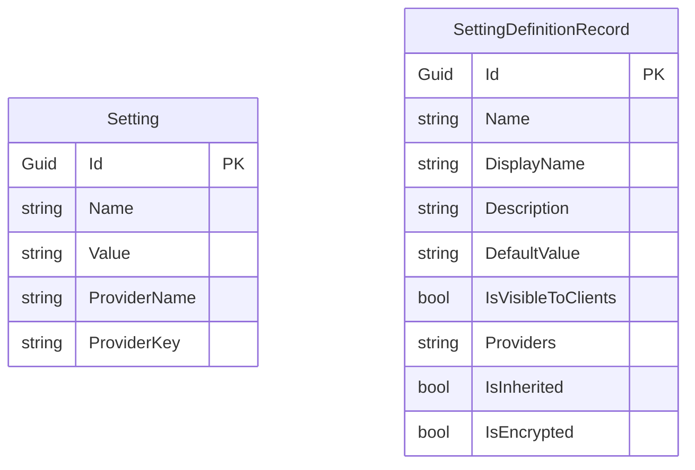

The Setting Management module mirrors Permission Management at a smaller scale. Two persisted types cover the runtime value-store and the design-time definition cache.

- `Setting` — a single key/value row scoped to a provider (Global, Tenant, User, …).
- `SettingDefinitionRecord` — a serialized form of an in-memory `SettingDefinition`, written by `StaticSettingSaver` so that the [`DynamicSettingDefinitionStore`](#integration-points) can rehydrate them in distributed deployments.

Source path: `modules/setting-management/src/Volo.Abp.SettingManagement.Domain/Volo/Abp/SettingManagement/`.

## Overview



## `Setting`

Base: `Entity<Guid>` + `IAggregateRoot<Guid>` (note: declared via interface, not via the `AggregateRoot<T>` class — there is no `ExtraProperties` or `ConcurrencyStamp`).

```csharp
public class Setting : Entity<Guid>, IAggregateRoot<Guid>
{
    [NotNull] public virtual string Name { get; protected set; }
    [NotNull] public virtual string Value { get; internal set; }
    [CanBeNull] public virtual string ProviderName { get; protected set; }
    [CanBeNull] public virtual string ProviderKey { get; protected set; }

    public Setting(Guid id, string name, string value, string providerName = null, string providerKey = null)
    {
        Id = id;
        Name = Check.NotNull(name, nameof(name));
        Value = Check.NotNull(value, nameof(value));
        ProviderName = providerName;
        ProviderKey = providerKey;
    }
}
```

### Properties

| Property        | Type     | Notes                                                                 |
| --------------- | -------- | --------------------------------------------------------------------- |
| `Id`            | `Guid`   | PK                                                                     |
| `Name`          | `string` | Setting definition name (e.g. `Abp.Localization.DefaultLanguage`).    |
| `Value`         | `string` | Raw value — interpretation belongs to the consuming subsystem.        |
| `ProviderName`  | `string` | `"D"` default, `"C"` configuration, `"G"` global, `"T"` tenant, `"U"` user. |
| `ProviderKey`   | `string` | Identity of the scope (user id, tenant id, …). Null for global.       |

### Indexes

- `UNIQUE (Name, ProviderName, ProviderKey)` — declared by `AbpSettingManagementEntityFrameworkCoreModelBuilderExtensions`.

### Why no full audit?

The setting store is treated as a high-write cache: rows are updated in place via `ISettingManagementStore`, and the surrounding cache (`SettingCacheItem`) carries the freshness signal. Auditing is delegated to the `AuditLog` module if the host opts in.

## `SettingDefinitionRecord`

Base: `BasicAggregateRoot<Guid>` + `IHasExtraProperties`. Mirrors `SettingDefinition` from `Volo.Abp.Settings`.

```csharp
public class SettingDefinitionRecord : BasicAggregateRoot<Guid>, IHasExtraProperties
{
    [NotNull] public string Name { get; set; }
    [NotNull] public string DisplayName { get; set; }
    [CanBeNull] public string Description { get; set; }
    [CanBeNull] public string DefaultValue { get; set; }
    public bool IsVisibleToClients { get; set; }
    public string Providers { get; set; }   // comma-separated provider names
    public bool IsInherited { get; set; }
    public bool IsEncrypted { get; set; }
    public ExtraPropertyDictionary ExtraProperties { get; protected set; }
}
```

| Property             | Type     | Constraints (`SettingDefinitionRecordConsts`)                  | Notes                                                       |
| -------------------- | -------- | -------------------------------------------------------------- | ----------------------------------------------------------- |
| `Name`               | `string` | `MaxNameLength` (128), unique                                  | Setting key.                                                 |
| `DisplayName`        | `string` | `MaxDisplayNameLength` (256)                                   | Localization key for UI.                                     |
| `Description`        | `string` | `MaxDescriptionLength` (256)                                   | Optional localization key.                                   |
| `DefaultValue`       | `string` | `MaxDefaultValueLength` (256)                                  | Falls back when no provider rows match.                      |
| `IsVisibleToClients` | `bool`   | Default `false`                                                | When true, the value is sent to remote clients.              |
| `Providers`          | `string` | `MaxProvidersLength` (128)                                     | Comma-separated allowed providers. Empty → all providers.   |
| `IsInherited`        | `bool`   | Default `true`                                                 | Inherits from parent scopes when not overridden.             |
| `IsEncrypted`        | `bool`   | Default `false`                                                | Stored encrypted via `ISettingEncryptionService`.            |
| `ExtraProperties`    | `ExtraPropertyDictionary` | —                                                  | Object-extension bucket.                                     |

### `HasSameData` / `Patch`

Same drift-detection pattern as `PermissionDefinitionRecord`. `StaticSettingSaver` calls `HasSameData` before deciding whether to issue a `Patch` against the row, and the patcher also reconciles `ExtraProperties`.

```csharp
public bool HasSameData(SettingDefinitionRecord otherRecord)
{
    if (Name != otherRecord.Name) return false;
    if (DisplayName != otherRecord.DisplayName) return false;
    if (Description != otherRecord.Description) return false;
    if (DefaultValue != otherRecord.DefaultValue) return false;
    if (IsVisibleToClients != otherRecord.IsVisibleToClients) return false;
    if (Providers != otherRecord.Providers) return false;
    if (IsInherited != otherRecord.IsInherited) return false;
    if (IsEncrypted != otherRecord.IsEncrypted) return false;
    if (!this.HasSameExtraProperties(otherRecord)) return false;
    return true;
}
```

## Tables and indexes

| Entity                    | Table                       | Notable indexes                          |
| ------------------------- | --------------------------- | ---------------------------------------- |
| `Setting`                 | `AbpSettings`               | `UNIQUE (Name, ProviderName, ProviderKey)` |
| `SettingDefinitionRecord` | `AbpSettingDefinitions`     | `UNIQUE (Name)`                          |

## Integration points

- `ISettingManagementStore` is implemented by `SettingManagementStore`, which queries `ISettingRepository` and caches lookups via `SettingCacheItem` (invalidated by `SettingCacheItemInvalidator` on save/delete events).
- `DynamicSettingDefinitionStore` projects `SettingDefinitionRecord` back into runtime `SettingDefinition`s for hosts that enabled dynamic settings.
- The pre-built providers in this module are `ConfigurationSettingManagementProvider`, `DefaultValueSettingManagementProvider`, and `GlobalSettingManagementProvider` — each implements `ISettingManagementProvider`. The Identity module ships `UserSettingManagementProvider`, and the Tenant Management module ships `TenantSettingManagementProvider`.

## See also

- [Setting Management module](/modules/setting-management)
- [`Volo.Abp.Settings`](/framework/cross/settings)
- [Permission Management entities](/reference/models/permission-management-entities) (parallel pattern)
- [Entity base types](/reference/models/entities-base-types)
