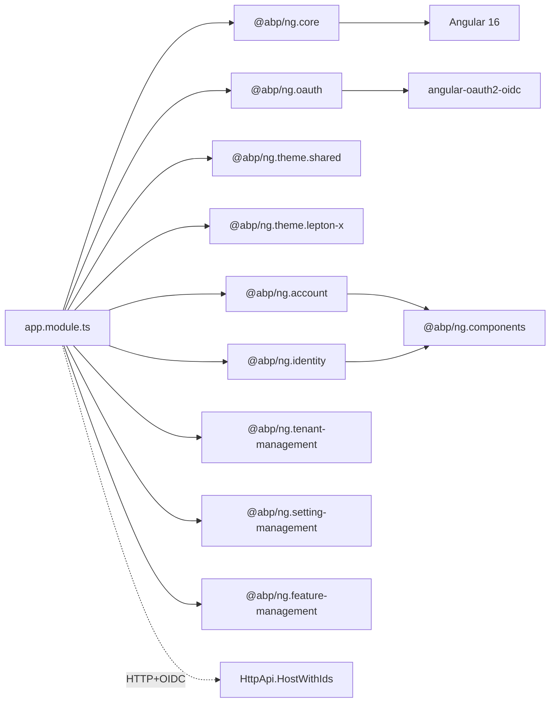

`templates/app/angular/` is the **Angular client** half of the flagship `app` template. The CLI scaffolds it whenever you pass `-u angular`. It is a standard Angular 16 workspace generated by `ng new`, then preconfigured with the `@abp/ng.*` packages, the LeptonX Lite theme, OAuth (PKCE), and lazy-loaded routes for the management UIs the backend ships.

The backend it talks to is the `HttpApi.HostWithIds` project (see [`app-aspnet-core`](/templates/app-aspnet-core)) — a single host that serves both the REST API and the OpenIddict endpoints on `https://localhost:44305`.

## Project tree

```text
templates/app/angular/
├── angular.json
├── package.json
├── tsconfig.json
├── tsconfig.app.json
├── tsconfig.spec.json
├── karma.conf.js
├── start.ps1                 # PowerShell helper that runs `ng serve --open`
├── README.md
└── src/
    ├── index.html
    ├── main.ts
    ├── polyfills.ts
    ├── styles.scss
    ├── test.ts
    ├── favicon.ico
    ├── assets/               # static assets copied verbatim
    ├── environments/
    │   ├── environment.ts
    │   └── environment.prod.ts
    └── app/
        ├── app.module.ts
        ├── app.component.ts
        ├── app-routing.module.ts
        ├── route.provider.ts
        ├── home/
        │   ├── home.module.ts
        │   ├── home-routing.module.ts
        │   ├── home.component.ts
        │   ├── home.component.html
        │   ├── home.component.scss
        │   └── home.component.spec.ts
        └── shared/
            └── shared.module.ts
```

Verify with `ls templates/app/angular/src/app`.

## Package dependency graph



The package versions in `package.json` are pinned at the time of templating (the in-repo template ships `@abp/ng.* ~7.4.0`, `@abp/ng.theme.lepton-x ~2.4.0-rc.4`, `@angular/* ~16.0.0`, `rxjs 7.8.1`, `bootstrap-icons ~1.8.3`). The CLI bumps these to the matching release of the rest of the framework when it generates a new solution.

## Key files

### `src/app/app.module.ts`

Wires the root NgModule. The template's actual list of imports is:

```ts
imports: [
  BrowserModule,
  BrowserAnimationsModule,
  AppRoutingModule,
  CoreModule.forRoot({ environment, registerLocaleFn: registerLocale() }),
  AbpOAuthModule.forRoot(),
  ThemeSharedModule.forRoot(),
  AccountConfigModule.forRoot(),
  IdentityConfigModule.forRoot(),
  TenantManagementConfigModule.forRoot(),
  SettingManagementConfigModule.forRoot(),
  ThemeLeptonXModule.forRoot(),
  SideMenuLayoutModule.forRoot(),
  FeatureManagementModule.forRoot(),
],
providers: [APP_ROUTE_PROVIDER],
bootstrap: [AppComponent],
```

- `CoreModule.forRoot` consumes `environment` (see below) and gives the rest of the stack the API base URL plus the OAuth client config.
- `AbpOAuthModule.forRoot` registers `angular-oauth2-oidc` and the ABP token interceptor.
- The `*ConfigModule.forRoot()` calls only register configuration — the actual UI modules are loaded lazily.
- `ThemeLeptonXModule` + `SideMenuLayoutModule` install the LeptonX Lite theme and side-menu shell.

### `src/app/app-routing.module.ts`

Lazy-loads every management UI. The shipped routes are:

```ts
const routes: Routes = [
  { path: '', pathMatch: 'full',
    loadChildren: () => import('./home/home.module').then(m => m.HomeModule) },
  { path: 'account',
    loadChildren: () => import('@abp/ng.account').then(m => m.AccountModule.forLazy()) },
  { path: 'identity',
    loadChildren: () => import('@abp/ng.identity').then(m => m.IdentityModule.forLazy()) },
  { path: 'tenant-management',
    loadChildren: () => import('@abp/ng.tenant-management').then(m => m.TenantManagementModule.forLazy()) },
  { path: 'setting-management',
    loadChildren: () => import('@abp/ng.setting-management').then(m => m.SettingManagementModule.forLazy()) },
];
```

Add your own feature modules by appending to this array, then exposing menu items via `RoutesService` (next file).

### `src/app/route.provider.ts`

Contributes top-level menu items via the ABP `RoutesService`:

```ts
function configureRoutes(routesService: RoutesService) {
  return () => {
    routesService.add([
      { path: '/', name: '::Menu:Home', iconClass: 'fas fa-home', order: 1, layout: eLayoutType.application },
    ]);
  };
}
```

The string `'::Menu:Home'` is an ABP localization key — the `::` prefix tells the localizer to look in the default resource (configured per environment).

### `src/environments/environment.ts`

This is the **single source of truth** for backend URLs and OAuth metadata:

```ts
export const environment = {
  production: false,
  application: { baseUrl: 'http://localhost:4200', name: 'MyProjectName', logoUrl: '' },
  oAuthConfig: {
    issuer: 'https://localhost:44305/',
    redirectUri: 'http://localhost:4200',
    clientId: 'MyProjectName_App',
    responseType: 'code',
    scope: 'offline_access MyProjectName',
    requireHttps: true,
  },
  apis: {
    default: {
      url: 'https://localhost:44305',
      rootNamespace: 'MyCompanyName.MyProjectName',
    },
  },
} as Environment;
```

- `oAuthConfig.clientId` (`MyProjectName_App`) **must match** the client seeded by `OpenIddictDataSeeder` in the backend.
- `apis.default.url` points at `HttpApi.HostWithIds`.
- `apis.default.rootNamespace` is used by the ABP TypeScript service proxy generator (`abp generate-proxy -t ng`) so the generated services land under `proxy/my-company-name/my-project-name/...`.

### `src/app/home/`

A skeleton landing page. `home.component.html` shows a hero banner with a "logged in" / "not logged in" state powered by `AuthService` from `@abp/ng.core`.

### `src/app/shared/shared.module.ts`

The empty shared module — re-export your own pipes, directives and components here.

## CLI usage

```bash
# Generate the full solution with the Angular client
abp new Acme.BookStore -t app -u angular

# Equivalent `dotnet new`
dotnet new abp -t app -u angular -o ./Acme.BookStore
```

The CLI places the Angular project under `angular/` next to the `aspnet-core/` backend, so the resulting folder is:

```text
Acme.BookStore/
├── aspnet-core/          # backend (no Web project, just HttpApi.HostWithIds + DbMigrator + …)
└── angular/              # this template, renamed
```

## Post-create checklist

1. **Install npm dependencies.** From `angular/`:
   ```bash
   npm install        # or `yarn install`
   ```
2. **Run the backend's database migrator** (one-time):
   ```bash
   cd ../aspnet-core/src/Acme.BookStore.DbMigrator
   dotnet run
   ```
   This seeds the OpenIddict client `MyProjectName_App` (renamed to `<YourName>_App` after the CLI rewrite) that the Angular app uses to authenticate.
3. **Start `HttpApi.HostWithIds`:**
   ```bash
   cd ../aspnet-core/src/Acme.BookStore.HttpApi.HostWithIds
   dotnet run
   ```
   Default port: `https://localhost:44305`. If you change it, update `environment.ts`.
4. **Trust the dev certificate** (Linux/macOS): `dotnet dev-certs https --trust`.
5. **Run the Angular app:**
   ```bash
   npm start          # alias for `ng serve --open`
   ```
   The dev server listens on `http://localhost:4200`. The login flow redirects to the backend's login page (Razor on the same domain as `HttpApi.HostWithIds`) and back.
6. **Regenerate the typed service proxies** (after every backend API change):
   ```bash
   abp generate-proxy -t ng -u https://localhost:44305
   ```
   Output: `src/app/proxy/`.

## Customisation hot-spots

- **Add a feature module.** `ng generate module features/orders --route orders --module app` then register the menu in `route.provider.ts` and the route under `app-routing.module.ts`.
- **Swap themes.** Replace `ThemeLeptonXModule` + `SideMenuLayoutModule` with `ThemeBasicModule` (free) or a commercial LeptonX bundle. The package list in `package.json` (`@abp/ng.theme.lepton-x` and `@abp/ng.theme.shared`) is the only place that needs editing.
- **Change OAuth flow.** The template uses Authorization Code + PKCE (`responseType: 'code'`). For implicit flow, set `responseType: 'id_token token'` and seed a matching OpenIddict application.
- **Multi-tenancy UI.** Configure the tenant placeholder by setting `application.name` and toggling the tenant box via `@abp/ng.theme.shared`'s `TenantBoxComponent`. The backend's tenant resolver expects a `__tenant` cookie or header — `@abp/ng.core` sends both automatically.
- **Localization.** Add JSON files under `src/assets/` (or, more commonly, let the backend serve translations via `/api/abp/application-localization`). The template's `CoreModule.forRoot` uses `registerLocale()` from `@abp/ng.core/locale` to pull translations live from the backend.
- **Production build:**
  ```bash
  npm run build:prod        # ng build --configuration production
  ```
  Outputs `dist/MyProjectName/`. Host it on any static web server; remember to update `environment.prod.ts` with the production API URL and OAuth `redirectUri`.

## CORS gotcha

`HttpApi.HostWithIds` must allow the Angular origin. In `aspnet-core/src/.../HttpApi.HostWithIds/appsettings.json` the `App:CorsOrigins` value already lists `http://localhost:4200` when scaffolded with Angular. If you change the port or deploy, update the entry — `MyProjectNameHttpApiHostModule.ConfigureCors` reads it.

## Source map

| Concept | Path |
|---|---|
| Root NgModule | `src/app/app.module.ts` |
| Routes | `src/app/app-routing.module.ts` |
| Menu | `src/app/route.provider.ts` |
| Environment / OAuth | `src/environments/environment.ts` |
| Home screen | `src/app/home/` |
| Angular CLI config | `angular.json` |
| Backend it talks to | `templates/app/aspnet-core/src/MyCompanyName.MyProjectName.HttpApi.HostWithIds/` (see [`app-aspnet-core`](/templates/app-aspnet-core)) |
| `@abp/ng.*` source | Not in this repo — published from `abpframework/abp-ng2-module`. |

For the mobile companion see [`app-react-native`](/templates/app-react-native).

## Sample task: add a feature module

The shipped template ships only `home/` as a non-management feature. A realistic add looks like this:

1. **Generate the module skeleton:**
   ```bash
   ng g module features/books --route books --module app
   ng g component features/books/book-list
   ng g service features/books/book
   ```
   The `--route` flag wires a lazy-load entry in `app-routing.module.ts`.
2. **Add a menu item** in `src/app/route.provider.ts`:
   ```ts
   routesService.add([
     { path: '/books', name: '::Menu:Books', iconClass: 'fas fa-book', order: 2, layout: eLayoutType.application },
   ]);
   ```
3. **Generate the typed proxy** for the backend's `BookAppService`:
   ```bash
   abp generate-proxy -t ng -m app -u https://localhost:44305
   ```
   Output lands under `src/app/proxy/books/`. Import `BookService` from there in your component.
4. **Localization key.** Add `"Menu:Books": "Books"` to your backend's `Localization/MyProjectName/en.json` (the Angular client pulls translations live through `/api/abp/application-localization`).

## Folder conventions

| Folder | What lives there |
|---|---|
| `src/app/<feature>/` | One folder per feature module — `home/` is the shipped example. |
| `src/app/shared/` | Re-exports for components/directives/pipes used by ≥2 features. |
| `src/app/proxy/` | Generated by `abp generate-proxy -t ng`. Never edit by hand. |
| `src/assets/` | Static images, fonts, JSON. |
| `src/environments/` | `environment.ts` (dev) + `environment.prod.ts` (production). |

## Permissions

Backed by the ABP `PermissionService` from `@abp/ng.core`. Guard routes with:

```ts
{
  path: 'books',
  loadChildren: () => import('./features/books/books.module').then(m => m.BooksModule),
  canActivate: [permissionGuard],
  data: { requiredPolicy: 'BookStore.Books' },
}
```

…and in templates with the `*abpPermission` structural directive:

```html
<button *abpPermission="'BookStore.Books.Create'" (click)="create()">New book</button>
```

The permission names must match the ones declared in the backend's `MyProjectNamePermissionDefinitionProvider`.

## Production deploy

```bash
npm run build:prod
```

Outputs `dist/MyProjectName/`. Update `src/environments/environment.prod.ts` with the production API URL and OAuth `redirectUri` first. Serve via Nginx, Cloudfront/S3, Azure Static Web Apps, etc. — the bundle is pure static files. CORS on the backend's `App:CorsOrigins` array must include the public origin.
