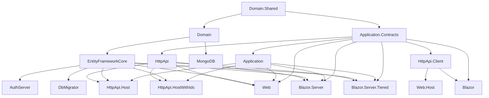

`templates/app/aspnet-core/` is the **flagship ABP solution template**. When you run `abp new Acme.BookStore -t app -u mvc -d ef`, the CLI clones this directory, rewrites `MyCompanyName.MyProjectName` to your name, then prunes the UI/database projects you did not select. The on-disk template keeps every variant so it is always buildable from the monorepo (the solution file references 17 source projects plus 7 test projects).

This page is a tour of those projects, what depends on what, and the post-create chores you have to run before the solution boots.

## Project tree

```text
templates/app/aspnet-core/
├── MyCompanyName.MyProjectName.sln
├── common.props                       # ABP version, TFM, lang version
├── NuGet.Config
├── src/
│   ├── MyCompanyName.MyProjectName.Domain.Shared/
│   │   ├── MyProjectNameDomainSharedModule.cs
│   │   ├── MyProjectNameDomainErrorCodes.cs
│   │   ├── MyProjectNameGlobalFeatureConfigurator.cs
│   │   ├── MyProjectNameModuleExtensionConfigurator.cs
│   │   ├── Localization/              # JSON resource files
│   │   └── MultiTenancy/MultiTenancyConsts.cs
│   ├── MyCompanyName.MyProjectName.Domain/
│   │   ├── MyProjectNameDomainModule.cs
│   │   ├── MyProjectNameConsts.cs
│   │   ├── Data/                      # IDbSchemaMigrator + DbMigrationService
│   │   ├── OpenIddict/                # OpenIddictDataSeeder
│   │   └── Settings/MyProjectNameSettings.cs
│   ├── MyCompanyName.MyProjectName.Application.Contracts/
│   │   ├── MyProjectNameApplicationContractsModule.cs
│   │   ├── MyProjectNameDtoExtensions.cs
│   │   └── Permissions/
│   │       ├── MyProjectNamePermissions.cs
│   │       └── MyProjectNamePermissionDefinitionProvider.cs
│   ├── MyCompanyName.MyProjectName.Application/
│   │   ├── MyProjectNameApplicationModule.cs
│   │   ├── MyProjectNameAppService.cs
│   │   └── MyProjectNameApplicationAutoMapperProfile.cs
│   ├── MyCompanyName.MyProjectName.EntityFrameworkCore/
│   │   ├── EntityFrameworkCore/
│   │   │   ├── MyProjectNameDbContext.cs
│   │   │   ├── MyProjectNameDbContextFactory.cs
│   │   │   ├── MyProjectNameEntityFrameworkCoreModule.cs
│   │   │   ├── MyProjectNameEfCoreEntityExtensionMappings.cs
│   │   │   └── EntityFrameworkCoreMyProjectNameDbSchemaMigrator.cs
│   │   └── Migrations/                # generated EF migrations
│   ├── MyCompanyName.MyProjectName.MongoDB/
│   │   ├── MongoDb/                   # DbContext + module
│   │   └── …
│   ├── MyCompanyName.MyProjectName.HttpApi/
│   │   ├── MyProjectNameHttpApiModule.cs
│   │   ├── Controllers/MyProjectNameController.cs
│   │   └── Models/
│   ├── MyCompanyName.MyProjectName.HttpApi.Client/
│   │   └── MyProjectNameHttpApiClientModule.cs
│   ├── MyCompanyName.MyProjectName.HttpApi.Host/         # API only, JWT bearer
│   ├── MyCompanyName.MyProjectName.HttpApi.HostWithIds/  # API + embedded AuthServer
│   ├── MyCompanyName.MyProjectName.AuthServer/           # Separated OpenIddict host
│   ├── MyCompanyName.MyProjectName.Web/                  # MVC + Razor UI (single-process)
│   ├── MyCompanyName.MyProjectName.Web.Host/             # MVC consumer of remote APIs (tiered)
│   ├── MyCompanyName.MyProjectName.Blazor/               # Blazor WebAssembly client
│   ├── MyCompanyName.MyProjectName.Blazor.Server/        # Blazor Server (single-tier)
│   ├── MyCompanyName.MyProjectName.Blazor.Server.Tiered/ # Blazor Server (tiered)
│   └── MyCompanyName.MyProjectName.DbMigrator/           # Console runner for migrations + seed
└── test/
    ├── MyCompanyName.MyProjectName.TestBase/
    ├── MyCompanyName.MyProjectName.Domain.Tests/
    ├── MyCompanyName.MyProjectName.Application.Tests/
    ├── MyCompanyName.MyProjectName.EntityFrameworkCore.Tests/
    ├── MyCompanyName.MyProjectName.MongoDB.Tests/
    ├── MyCompanyName.MyProjectName.Web.Tests/
    └── MyCompanyName.MyProjectName.HttpApi.Client.ConsoleTestApp/
```

Every project name and folder above is real and shipped under `templates/app/aspnet-core/src/` — verify with `ls templates/app/aspnet-core/src`.

## Dependency graph



The shape mirrors the canonical ABP **DDD layering**:

- `Domain.Shared` is referenced by everything. It only contains constants, enums, error codes, localization resources and global feature/extension configurators — no entities.
- `Domain` references `Domain.Shared`. It depends on the ABP module modules `AbpAuditLoggingDomainModule`, `AbpBackgroundJobsDomainModule`, `AbpFeatureManagementDomainModule`, `AbpIdentityDomainModule`, `AbpOpenIddictDomainModule`, `AbpPermissionManagementDomainOpenIddictModule`, `AbpPermissionManagementDomainIdentityModule`, `AbpSettingManagementDomainModule`, `AbpTenantManagementDomainModule`, `AbpEmailingModule` (see `MyProjectNameDomainModule.cs`).
- `Application.Contracts` declares DTOs and permission constants. The template's contracts module depends on `AbpAccountApplicationContractsModule`, `AbpIdentityApplicationContractsModule`, `AbpPermissionManagementApplicationContractsModule`, `AbpSettingManagementApplicationContractsModule`, `AbpTenantManagementApplicationContractsModule`, `AbpFeatureManagementApplicationContractsModule`, `AbpObjectExtendingModule`.
- `Application` references `Application.Contracts` + `Domain` and is the only place application services live.
- `EntityFrameworkCore` and `MongoDB` are **sibling** infrastructure projects — only one is wired into the host you pick. The EF Core module depends on `AbpEntityFrameworkCoreSqlServerModule` by default (swap to `Volo.Abp.EntityFrameworkCore.PostgreSql` / `.MySQL` etc. for other providers).
- `HttpApi` contains conventional controllers; `HttpApi.Client` ships the proxies for consumers (Blazor WASM, ConsoleTestApp).
- The hosts come in four flavours described below.

## The four host shapes

| Host project | When the CLI uses it | Identity strategy |
|---|---|---|
| `Web` | `-u mvc` (default, non-tiered) | Embedded OpenIddict in the same process as MVC. |
| `Web.Host` + `AuthServer` + `HttpApi.Host` | `-u mvc --tiered` | Separated: `AuthServer` issues tokens, `HttpApi.Host` validates JWT, `Web.Host` is a thin MVC proxy. |
| `Blazor.Server` | `-u blazor-server` non-tiered | Single-process Blazor Server with embedded auth. |
| `Blazor.Server.Tiered` + `AuthServer` + `HttpApi.Host` | `-u blazor-server --tiered` | Same separation pattern as MVC tiered. |
| `Blazor` + `HttpApi.HostWithIds` | `-u blazor` (WebAssembly) | WebAssembly client; `HttpApi.HostWithIds` hosts the API and OpenIddict together. |
| `HttpApi.HostWithIds` only | `-u angular` or `-u none` | Single host that serves the API and the OpenIddict endpoints. |

Pick exactly one row when you scaffold; the CLI deletes the others.

### `Web` module wiring

`MyProjectNameWebModule` in `src/MyCompanyName.MyProjectName.Web/MyProjectNameWebModule.cs` depends on:

```csharp
[DependsOn(
    typeof(MyProjectNameHttpApiModule),
    typeof(MyProjectNameApplicationModule),
    typeof(MyProjectNameEntityFrameworkCoreModule),
    typeof(AbpAutofacModule),
    typeof(AbpIdentityWebModule),
    typeof(AbpSettingManagementWebModule),
    typeof(AbpAccountWebOpenIddictModule),
    typeof(AbpAspNetCoreMvcUiLeptonXLiteThemeModule),
    typeof(AbpTenantManagementWebModule),
    typeof(AbpAspNetCoreSerilogModule),
    typeof(AbpSwashbuckleModule)
)]
```

It is therefore a **single-process** host: API + UI + identity all in one. `Volo.Abp.AspNetCore.Mvc.UI.Theme.LeptonXLite` is the default theme (replace with `AbpAspNetCoreMvcUiBasicThemeModule` for the free Basic theme).

### `HttpApi.Host` module wiring

`MyProjectNameHttpApiHostModule` is JWT-only — see its `ConfigureAuthentication` call. Depends on `MyProjectNameHttpApiModule`, `AbpAutofacModule`, `AbpCachingStackExchangeRedisModule`, `AbpDistributedLockingModule`, `AbpAspNetCoreMvcUiMultiTenancyModule`, `MyProjectNameApplicationModule`, `MyProjectNameEntityFrameworkCoreModule`, `AbpAspNetCoreSerilogModule`, `AbpSwashbuckleModule`. It expects a separate `AuthServer` running on port 44322; tokens are validated via the `AuthServer` URL configured in `appsettings.json` `AuthServer:Authority`.

### `AuthServer`

`MyProjectNameAuthServerModule` depends on `AbpAccountWebOpenIddictModule`, `AbpAccountApplicationModule`, `AbpAccountHttpApiModule`, `AbpAspNetCoreMvcUiLeptonXLiteThemeModule`, `AbpAutofacModule`, `MyProjectNameEntityFrameworkCoreModule`, plus distributed caching/locking. It hosts the login UI and the OpenIddict authorisation/token/userinfo endpoints. The clients (`HttpApi.HostWithIds`, `Web.Host`, `Blazor`, `Angular`) are seeded into the OpenIddict database by `Domain/OpenIddict/OpenIddictDataSeeder.cs`.

### `Blazor` (WebAssembly)

`MyProjectNameBlazorModule` depends on `AbpAutofacWebAssemblyModule`, `MyProjectNameHttpApiClientModule`, `AbpAspNetCoreComponentsWebAssemblyLeptonXLiteThemeModule`, `AbpIdentityBlazorWebAssemblyModule`, `AbpTenantManagementBlazorWebAssemblyModule`, `AbpSettingManagementBlazorWebAssemblyModule`. It runs in the browser and talks to `HttpApi.HostWithIds`.

## Key files you will edit

| Area | Path | What goes there |
|---|---|---|
| Entities | `src/.../Domain/<aggregate>/<Entity>.cs` | New aggregate roots and value objects. |
| Permissions | `src/.../Application.Contracts/Permissions/MyProjectNamePermissions.cs` | Static permission name constants. |
| Permission tree | `src/.../Application.Contracts/Permissions/MyProjectNamePermissionDefinitionProvider.cs` | Build the permission groups consumed by the management UI. |
| DTOs | `src/.../Application.Contracts/<feature>/Dto/...` | Input/output of `IApplicationService`s. |
| App services | `src/.../Application/<feature>/<Feature>AppService.cs` | Implement `IApplicationService` (inherit from `MyProjectNameAppService`). |
| AutoMapper profile | `src/.../Application/MyProjectNameApplicationAutoMapperProfile.cs` | Entity ↔ DTO mappings. |
| DbContext | `src/.../EntityFrameworkCore/EntityFrameworkCore/MyProjectNameDbContext.cs` | Add `DbSet<>` properties and `OnModelCreating` calls. |
| Mongo context | `src/.../MongoDB/MongoDb/MyProjectNameMongoDbContext.cs` | Collection registrations for Mongo. |
| Settings | `src/.../Domain/Settings/MyProjectNameSettings.cs` & corresponding provider | Strongly-typed setting keys. |
| Localization | `src/.../Domain.Shared/Localization/MyProjectName/en.json` (+ siblings) | UI strings. The list of supported cultures is wired in `MyProjectNameDomainModule.ConfigureServices` (ar, cs, en, en-GB, hu, hr, fi, fr, hi, it, pt-BR, ru, sk, tr, zh-Hans, zh-Hant, de-DE, es). |
| Menu | `src/.../Web/Menus/MyProjectNameMenuContributor.cs` (also under `Blazor*`) | Top-level navigation. |
| Branding | `src/.../Web/MyProjectNameBrandingProvider.cs` | App name shown in the header/login. |
| Multi-tenancy switch | `src/.../Domain.Shared/MultiTenancy/MultiTenancyConsts.IsEnabled` | Flips `AbpMultiTenancyOptions.IsEnabled`. |
| OpenIddict client seed | `src/.../Domain/OpenIddict/OpenIddictDataSeeder.cs` | Clients/scopes seeded by `DbMigrator`. |
| EF migrations | `src/.../EntityFrameworkCore/Migrations/` | Code-first migration history. |

## CLI usage

```bash
# MVC + EF Core + SQL Server (default)
abp new Acme.BookStore -t app

# MVC + Mongo
abp new Acme.BookStore -t app -d mongodb

# Tiered MVC (Web.Host + AuthServer + HttpApi.Host)
abp new Acme.BookStore -t app --tiered

# Blazor WebAssembly + HttpApi.HostWithIds
abp new Acme.BookStore -t app -u blazor

# Blazor Server, single-tier
abp new Acme.BookStore -t app -u blazor-server

# Headless API only (consumed by Angular / mobile)
abp new Acme.BookStore -t app -u angular --mobile react-native
```

Equivalent `dotnet new abp -t app …` syntax accepts the same flags. Run `abp new -h` to print the canonical option list.

## Post-create checklist

After the CLI finishes:

1. **Restore packages.**
   ```bash
   dotnet restore
   ```
2. **Install client libraries.** ABP's UI projects pull bootstrap, fontawesome, themes via the LibMan-compatible `abp install-libs`:
   ```bash
   abp install-libs
   ```
   The list of resources is defined in each UI project's `package.json` and `abp.resourcemapping.js` (e.g. `src/MyCompanyName.MyProjectName.Web/abp.resourcemapping.js`).
3. **Confirm connection strings.** Edit `appsettings.json` in the host project you will run:
   - `Web` for non-tiered MVC.
   - `HttpApi.HostWithIds` for Angular / Blazor WASM / `--no-ui`.
   - `Web.Host` + `AuthServer` + `HttpApi.Host` for `--tiered`.
   - `DbMigrator` for the migration runner. The defaults point at `Server=(LocalDb)\\MSSQLLocalDB;Database=MyProjectName;Trusted_Connection=True`.
4. **Run the database migrator.** This is mandatory — it creates the SQL schema, seeds OpenIddict applications, and inserts an admin user (`admin@abp.io` / `1q2w3E*`).
   ```bash
   cd src/Acme.BookStore.DbMigrator
   dotnet run
   ```
   `DbMigratorHostedService` resolves `MyProjectNameDbMigrationService` and calls `MigrateAsync()` for every tenant.
5. **Start the host.** From the chosen host project:
   ```bash
   dotnet run
   ```
6. **(Tiered only) start in this order:** `AuthServer` → `HttpApi.Host` → `Web.Host` / `Blazor.Server.Tiered`. The launch profiles in `Properties/launchSettings.json` pin standard ports (44322 / 44324 / 44325).

## Customisation hot-spots

- **Add a new database provider.** Replace the package reference and `AbpEntityFrameworkCoreSqlServerModule` in `MyProjectNameEntityFrameworkCoreModule.cs` with one of `AbpEntityFrameworkCorePostgreSqlModule`, `AbpEntityFrameworkCoreMySQLModule`, `AbpEntityFrameworkCoreOracleModule`, `AbpEntityFrameworkCoreSqliteModule`. The template includes a guarded `Npgsql.EnableLegacyTimestampBehavior` switch for PostgreSQL.
- **Disable multi-tenancy.** Set `MultiTenancyConsts.IsEnabled = false` in `Domain.Shared/MultiTenancy/MultiTenancyConsts.cs`. The Domain module reads this constant when configuring `AbpMultiTenancyOptions`.
- **Switch theme.** Replace `AbpAspNetCoreMvcUiLeptonXLiteThemeModule` with the commercial `LeptonXThemeModule` (separate NuGet) or the free Basic theme. Update the matching `Bundling` modules and the `AbpBundlingOptions` configuration in `MyProjectNameWebModule.cs`.
- **Add a module reference.** `Volo.Abp.Cms.Kit`, `Volo.Abp.LeptonTheme.*`, custom internal modules: add `[DependsOn(typeof(MyModule))]` to the appropriate layer's module (`Domain`, `Application.Contracts`, `EntityFrameworkCore` and the host).
- **Tweak supported cultures.** Edit the `Languages.Add(...)` calls in `MyProjectNameDomainModule.ConfigureServices` to add or remove languages.
- **Replace email provider.** The Domain module replaces `IEmailSender` with `NullEmailSender` under `#if DEBUG`. Remove that block and configure SMTP via `appsettings.json` `Settings:Abp.Mailing.*`.

## Test projects

The `test/` folder is shipped intact and runs against an in-memory EF Core SQLite database (configured in `MyCompanyName.MyProjectName.EntityFrameworkCore.Tests`). The MongoDB test project uses `Mongo2Go`. Use `dotnet test` from the root once everything restores.

## Source map (template → framework)

| Template artefact | Framework counterpart |
|---|---|
| `MyProjectNameDomainModule` | `framework/src/Volo.Abp.Ddd.Domain/Volo/Abp/Domain/AbpDddDomainModule.cs` |
| `MyProjectNameApplicationModule` | `framework/src/Volo.Abp.Ddd.Application/Volo/Abp/Application/AbpDddApplicationModule.cs` |
| `MyProjectNameDbContext` | `framework/src/Volo.Abp.EntityFrameworkCore/Volo/Abp/EntityFrameworkCore/AbpDbContext.cs` |
| `MyProjectNameMongoDbContext` | `framework/src/Volo.Abp.MongoDB/Volo/Abp/Domain/Repositories/MongoDB/AbpMongoDbContext.cs` |
| `MyProjectNameWebModule` | `framework/src/Volo.Abp.AspNetCore.Mvc.UI/Volo/Abp/AspNetCore/Mvc/UI/AbpAspNetCoreMvcUiModule.cs` |
| `MyProjectNameHttpApiHostModule` | `framework/src/Volo.Abp.AspNetCore.Mvc/Volo/Abp/AspNetCore/Mvc/AbpAspNetCoreMvcModule.cs` |
| `MyProjectNameAuthServerModule` | `modules/openiddict/src/Volo.Abp.OpenIddict.AspNetCore/` & `modules/account/src/Volo.Abp.Account.Web.OpenIddict/` |
| `DbMigratorHostedService` | `framework/src/Volo.Abp.Data/Volo/Abp/Data/IDataSeeder.cs` |

See [`module-template`](/templates/module-template) for the same shape applied to a reusable library, or [`app-nolayers`](/templates/app-nolayers) for the single-project alternative.
