`templates/app-nolayers/` is the **one-project version** of the flagship `app` template. Rather than separating Domain / Application.Contracts / Application / EF Core / HttpApi / Web into discrete csprojs, every layer collapses into a single ASP.NET Core project. The CLI still ships the same modules (Identity, OpenIddict, tenant management, settings, audit logging) and the same end-user features — they just live next to each other in folders inside one project.

This template is aimed at small or solo apps where the ceremony of the layered DDD shape gets in the way. It is **not** intended for shared/reusable code: if you want to publish your app as a module, use [`module-template`](/templates/module-template) instead.

## What ships under the folder

```text
templates/app-nolayers/
├── aspnet-core/
│   ├── MyCompanyName.MyProjectName.sln
│   ├── NuGet.Config
│   ├── README.md
│   ├── migrate-database.ps1               # one-liner: dotnet run --project … --migrate-database
│   ├── MyCompanyName.MyProjectName.Host/                  # API-only host, EF Core
│   ├── MyCompanyName.MyProjectName.Host.Mongo/            # API-only host, MongoDB
│   ├── MyCompanyName.MyProjectName.Mvc/                   # MVC + UI, EF Core
│   ├── MyCompanyName.MyProjectName.Mvc.Mongo/             # MVC + UI, MongoDB
│   ├── MyCompanyName.MyProjectName.Blazor.Server/         # Blazor Server, EF Core
│   ├── MyCompanyName.MyProjectName.Blazor.Server.Mongo/   # Blazor Server, MongoDB
│   └── MyCompanyName.MyProjectName.Blazor.WebAssembly/
│       ├── Client/                # WebAssembly client
│       ├── Server.Mongo/          # Backend host (MongoDB)
│       └── …                      # Backend host (EF Core)
└── angular/
    ├── angular.json
    ├── package.json
    └── src/app/                   # Same shape as templates/app/angular
```

The CLI keeps only the variant you select and rewrites placeholders. So scaffolding with `-u mvc -d ef` retains only `MyCompanyName.MyProjectName.Mvc/`.

## Per-project layout

Every variant follows the same internal folder convention:

```text
MyCompanyName.MyProjectName.<Variant>/
├── MyCompanyName.MyProjectName.<Variant>.csproj
├── MyProjectNameModule.cs            # one giant AbpModule that depends on all sub-modules
├── MyProjectNameBrandingProvider.cs  # (UI variants only)
├── Program.cs                        # WebApplication.CreateBuilder + UseAutofac + --migrate-database switch
├── appsettings.json
├── Data/
│   ├── MyProjectNameDbContext.cs
│   ├── MyProjectNameDbContextFactory.cs
│   ├── MyProjectNameDbMigrationService.cs
│   └── MyProjectNameEFCoreDbSchemaMigrator.cs
├── Entities/                         # Your aggregate roots live here
├── Services/
│   └── Dtos/                         # Your DTOs
├── ObjectMapping/                    # AutoMapper profiles
├── Localization/MyProjectName/       # JSON resource files
├── Menus/MyProjectNameMenuContributor.cs
├── Migrations/                       # EF Core code-first migrations (EF variants only)
├── Pages/ or Components/             # Razor pages or Blazor components
└── wwwroot/
```

The Mongo variants replace `Data/` with `Data/` containing a `MyProjectNameMongoDbContext.cs` and a `MongoDbMyProjectNameDbSchemaMigrator.cs`.

## Variant matrix

| Project | UI flag | DB flag | Notes |
|---|---|---|---|
| `MyCompanyName.MyProjectName.Host` | `-u none` | `-d ef` | Headless API for Angular / mobile clients. |
| `MyCompanyName.MyProjectName.Host.Mongo` | `-u none` | `-d mongodb` | Same, on Mongo. |
| `MyCompanyName.MyProjectName.Mvc` | `-u mvc` (default) | `-d ef` | Razor Pages UI + embedded OpenIddict. |
| `MyCompanyName.MyProjectName.Mvc.Mongo` | `-u mvc` | `-d mongodb` | |
| `MyCompanyName.MyProjectName.Blazor.Server` | `-u blazor-server` | `-d ef` | |
| `MyCompanyName.MyProjectName.Blazor.Server.Mongo` | `-u blazor-server` | `-d mongodb` | |
| `MyCompanyName.MyProjectName.Blazor.WebAssembly/` (3 subfolders) | `-u blazor` | `-d ef` / `mongodb` | The `Client` project is hosted by `Server` (EF) or `Server.Mongo`. |

Verify with `ls templates/app-nolayers/aspnet-core/`.

## Module graph (Mvc + EF variant)

```mermaid
graph TD
    M[MyProjectNameModule]
    M --> Mvc[AbpAspNetCoreMvcModule]
    M --> Autofac[AbpAutofacModule]
    M --> AM[AbpAutoMapperModule]
    M --> Ef[AbpEntityFrameworkCoreSqlServerModule]
    M --> Sw[AbpSwashbuckleModule]
    M --> Ser[AbpAspNetCoreSerilogModule]
    M --> Lx[AbpAspNetCoreMvcUiLeptonXLiteThemeModule]
    M --> AcA[AbpAccountApplicationModule]
    M --> AcH[AbpAccountHttpApiModule]
    M --> AcW[AbpAccountWebOpenIddictModule]
    M --> Id[AbpIdentityEntityFrameworkCoreModule]
    M --> IdA[AbpIdentityApplicationModule]
    M --> IdH[AbpIdentityHttpApiModule]
    M --> IdW[AbpIdentityWebModule]
    M --> Oi[AbpOpenIddictEntityFrameworkCoreModule]
    M --> Pm[AbpPermissionManagementDomainIdentityModule]
    M --> Po[AbpPermissionManagementDomainOpenIddictModule]
    M --> Pe[AbpPermissionManagementEntityFrameworkCoreModule]
    M --> Sm[AbpSettingManagementEntityFrameworkCoreModule]
    M --> Tm[AbpTenantManagementEntityFrameworkCoreModule]
    M --> Au[AbpAuditLoggingEntityFrameworkCoreModule]
    M --> Fm[AbpFeatureManagementEntityFrameworkCoreModule]
```



Compare this with the multi-project `app` template, where the same set of dependencies is **partitioned across seven `AbpModule` classes** (Domain, Application.Contracts, Application, EF Core, HttpApi, Web, plus the host). The `app-nolayers` variant just declares them all at once on the host module.

## Key files

### `Program.cs`

The shipped `Mvc/Program.cs` uses `WebApplication.CreateBuilder` and an in-process `--migrate-database` switch — the same exe migrates and serves:

```csharp
var builder = WebApplication.CreateBuilder(args);
builder.Host.AddAppSettingsSecretsJson().UseAutofac().UseSerilog();
if (IsMigrateDatabase(args))
{
    builder.Services.AddDataMigrationEnvironment();
}
await builder.AddApplicationAsync<MyProjectNameModule>();
var app = builder.Build();
await app.InitializeApplicationAsync();

if (IsMigrateDatabase(args))
{
    await app.Services.GetRequiredService<MyProjectNameDbMigrationService>().MigrateAsync();
    return 0;
}
await app.RunAsync();

private static bool IsMigrateDatabase(string[] args)
    => args.Any(x => x.Contains("--migrate-database", StringComparison.OrdinalIgnoreCase));
```

`migrate-database.ps1` is the one-liner that runs it — exactly:

```powershell
dotnet run --project MyCompanyName.MyProjectName --migrate-database
```

### `MyProjectNameModule.cs`

A single `AbpModule` annotated with the long `[DependsOn(...)]` list shown in the graph above. Inside `ConfigureServicesAsync` it wires:

- `AbpDbContextOptions.UseSqlServer()` (or `UseNpgsql` for PostgreSQL — the `Npgsql.EnableLegacyTimestampBehavior` switch is guarded by a `TEMPLATE-REMOVE` block in `Program.cs`).
- `AbpAuditingOptions`, `AbpLocalizationOptions` (the supported cultures), `AbpMultiTenancyOptions`.
- OpenIddict server endpoints and validation.
- Bundling, virtual filesystem, branding.
- Conventional controllers for every assembly (`ConventionalControllers.Create(typeof(MyProjectNameModule).Assembly)`).

### `Data/MyProjectNameDbContext.cs`

Same `AbpDbContext<MyProjectNameDbContext>` shape as the layered template, including the `[ReplaceDbContext(typeof(IIdentityDbContext))]` and `[ReplaceDbContext(typeof(ITenantManagementDbContext))]` attributes so the identity/tenant modules share this DbContext.

### `Data/MyProjectNameDbMigrationService.cs`

Resolves the registered schema migrators (`IMyProjectNameDbSchemaMigrator`) and runs them for the host and every tenant. Mongo variants ship `MongoDbMyProjectNameDbSchemaMigrator` instead.

### `Services/` and `Entities/`

The shipped folders are empty. Drop your aggregate roots in `Entities/` and your application services in `Services/`. The conventional controllers convention picks them up automatically — services suffixed with `AppService` (and registered as `IApplicationService`) get HTTP endpoints under `/api/app/<service>`.

### `Menus/MyProjectNameMenuContributor.cs`

Implements `IMenuContributor` and adds top-level menu items. Edit this file to add menu entries for the new pages you build.

## CLI usage

```bash
# Default: MVC + EF Core
abp new Acme.BookStore -t app-nolayers

# MVC + Mongo
abp new Acme.BookStore -t app-nolayers -d mongodb

# Blazor Server + EF Core
abp new Acme.BookStore -t app-nolayers -u blazor-server

# Blazor WebAssembly hosted, EF Core
abp new Acme.BookStore -t app-nolayers -u blazor

# Headless API
abp new Acme.BookStore -t app-nolayers --no-ui

# Headless API + Angular client
abp new Acme.BookStore -t app-nolayers -u angular
```

Equivalent `dotnet new abp -t app-nolayers …`.

## Post-create checklist

1. **Restore packages:** `dotnet restore`.
2. **Install client libraries** (UI variants only): from the project root,
   ```bash
   abp install-libs
   ```
3. **Edit `appsettings.json`** in the chosen project. Defaults:
   - EF: `Server=(LocalDb)\\MSSQLLocalDB;Database=MyProjectName;Trusted_Connection=True`
   - Mongo: `mongodb://localhost:27017/MyProjectName`
4. **Run the migrator from the same exe** (one-time and after every model change):
   ```bash
   cd src/Acme.BookStore.Mvc           # or whichever variant
   dotnet run --migrate-database
   ```
   This is the only difference from the layered `app` template — there is no separate `DbMigrator` project. The `--migrate-database` switch in `Program.cs` calls `MyProjectNameDbMigrationService.MigrateAsync()` and exits.
5. **Run the app:** `dotnet run`. Default ports come from `Properties/launchSettings.json` (`https://localhost:44382` for MVC, `https://localhost:44307` for Blazor Server, etc.).
6. **Login:** `admin` / `1q2w3E*`.
7. **(Angular client)** in `angular/` run `npm install` then `npm start`; the OAuth client is seeded into the embedded OpenIddict store by the migrator. Update `src/environments/environment.ts` if you change ports.

## Customisation hot-spots

- **Swap database provider.** Replace `AbpEntityFrameworkCoreSqlServerModule` in `MyProjectNameModule.cs` with `AbpEntityFrameworkCorePostgreSqlModule` (etc.) and update the `appsettings.json` connection string. For PostgreSQL the `AppContext.SetSwitch("Npgsql.EnableLegacyTimestampBehavior", true)` line in `Program.cs` must stay.
- **Add a feature.** Drop entities under `Entities/`, DTOs under `Services/Dtos/`, app services under `Services/`. Run `abp generate-proxy` (for the Angular client) or hit the new endpoints from the MVC pages.
- **Add a migration.** From the project folder: `dotnet ef migrations add MyChange` then `dotnet run --migrate-database` to apply.
- **Disable multi-tenancy.** Set `Configure<AbpMultiTenancyOptions>(o => o.IsEnabled = false)` in `ConfigureServicesAsync`. There is no separate `MultiTenancyConsts` class in this template.
- **Theme.** Replace `AbpAspNetCoreMvcUiLeptonXLiteThemeModule` (free) with the commercial LeptonX module (paid) or the Basic theme.
- **EF Core ↔ Mongo.** The two variants are separate projects — there is no on-the-fly switch. If you start with EF and want Mongo, scaffold a fresh solution rather than retro-fitting.

## When to choose `app-nolayers` vs `app`

| Use `app-nolayers` when | Use `app` when |
|---|---|
| You want one csproj per host, one `dotnet run` to migrate + serve. | You need clean module/assembly boundaries (DDD bounded contexts, internal teams, multiple front-ends). |
| The project will not be reused as a library. | You plan to share Application/Domain across processes (HTTP API + worker + Blazor). |
| You prefer to discover ABP without the full module tree. | You want separate AuthServer/HttpApi.Host/Web.Host (tiered). |
| You will keep it small and start solo. | You will grow a team and add tests per layer. |

For reusable shared code use [`module-template`](/templates/module-template); for non-web hosts see [`console-template`](/templates/console-template), [`maui-template`](/templates/maui-template) and [`wpf-template`](/templates/wpf-template).

## Source map

| Concept | Path |
|---|---|
| Variant matrix | `templates/app-nolayers/aspnet-core/` |
| One-shot migrator script | `templates/app-nolayers/aspnet-core/migrate-database.ps1` |
| The `--migrate-database` switch | `MyCompanyName.MyProjectName.<Variant>/Program.cs` |
| Single `AbpModule` | `MyCompanyName.MyProjectName.<Variant>/MyProjectNameModule.cs` |
| Schema migrator (EF) | `Data/MyProjectNameEFCoreDbSchemaMigrator.cs` |
| Schema migrator (Mongo) | `Data/MongoDbMyProjectNameDbSchemaMigrator.cs` |
| Angular client | `templates/app-nolayers/angular/src/app/` |

## What gets cut compared to `app`

Concrete deletions when you scaffold `app-nolayers` instead of `app`:

| `app` artefact | Disposition under `app-nolayers` |
|---|---|
| `Domain.Shared.csproj` | Merged into the host project. |
| `Domain.csproj` | Merged. |
| `Application.Contracts.csproj` | Merged. |
| `Application.csproj` | Merged. |
| `EntityFrameworkCore.csproj` | Becomes `Data/` folder inside the host. |
| `MongoDB.csproj` | Becomes `Data/` folder inside the `.Mongo` host variant. |
| `HttpApi.csproj` | Merged — controllers live next to pages. |
| `HttpApi.Client.csproj` | Dropped. The Angular/React Native sibling generates its own typed proxies via `abp generate-proxy`. |
| `HttpApi.Host.csproj` / `HttpApi.HostWithIds.csproj` | Replaced by `MyCompanyName.MyProjectName.Host` (headless) or merged into `Mvc`/`Blazor.Server` (UI variants). |
| `AuthServer.csproj` | Replaced — OpenIddict endpoints are hosted in-process in every variant. |
| `DbMigrator.csproj` | Replaced by the `--migrate-database` switch inside `Program.cs` (`migrate-database.ps1` invokes it). |
| `Domain.Tests`, `Application.Tests`, `EntityFrameworkCore.Tests`, `MongoDB.Tests`, `Web.Tests`, `TestBase`, `HttpApi.Client.ConsoleTestApp` | All seven test projects are dropped. Add your own when needed. |

## Tradeoffs

- **+** Fewer projects to compile, faster `dotnet build`, simpler launch profiles.
- **+** One `dotnet run --migrate-database` instead of a separate console exe.
- **+** Easier first-day experience for newcomers — no need to know which project holds what.
- **−** Hard limit on growth. Once you start splitting the app into bounded contexts you'll need to re-create as the layered `app` template.
- **−** No shared libraries. If a second host (worker, microservice, mobile API gateway) ever needs your domain types, you can't reference them — you have to copy or refactor.
- **−** No test projects shipped. The layered template ships seven; here you start from zero.

## Sample customisation: adding an entity

In a fresh `Mvc + EF` solution called `Acme.BookStore`:

1. Add `Entities/Book.cs`:
   ```csharp
   public class Book : FullAuditedAggregateRoot<Guid>
   {
       public string Name { get; set; } = default!;
       public BookType Type { get; set; }
       public DateTime PublishDate { get; set; }
       public float Price { get; set; }
   }
   ```
2. Add `Entities/BookType.cs` (enum) and any sub-entities.
3. Register in `Data/MyProjectNameDbContext.cs`:
   ```csharp
   public DbSet<Book> Books { get; set; }
   ```
   …and in `OnModelCreating`:
   ```csharp
   builder.Entity<Book>(b =>
   {
       b.ToTable(MyProjectNameConsts.DbTablePrefix + "Books");
       b.ConfigureByConvention();
       b.Property(x => x.Name).IsRequired().HasMaxLength(128);
   });
   ```
4. Generate a migration:
   ```bash
   dotnet ef migrations add Added_Books
   dotnet run --migrate-database
   ```
5. Add `Services/BookAppService.cs` derived from `CrudAppService<Book, BookDto, Guid, PagedAndSortedResultRequestDto, CreateUpdateBookDto>`.
6. Add the AutoMapper profile in `ObjectMapping/`.
7. Add Razor pages or a Blazor component to render it, plus a menu entry in `Menus/MyProjectNameMenuContributor.cs`.

That's the whole flow — entity, migration, service, UI — in one project.
