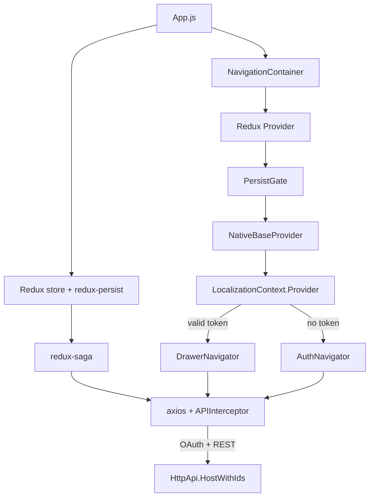

`templates/app/react-native/` is the **mobile companion** that the CLI adds when you pass `--mobile react-native` to `abp new`. It is an Expo (`expo ^47`) React Native (`0.70.5`) app already wired with Redux Toolkit, redux-saga, axios interceptors, `i18n-js` localization, NativeBase UI components, and a complete authentication / identity / tenant-management flow that mirrors the backend's Razor pages and the Angular client.

It talks to the ABP backend's `HttpApi.HostWithIds` over the OAuth 2.0 **password** grant by default (because Expo does not provide a built-in PKCE browser flow without ejecting). The OpenIddict application seed in `OpenIddictDataSeeder.cs` therefore registers a public client called `MyProjectName_App` that allows password and refresh_token grants.

## Project tree

```text
templates/app/react-native/
├── App.js                   # Root component — navigation, store, providers
├── Environment.js           # API URL + OAuth + localization config
├── app.json                 # Expo manifest
├── babel.config.js
├── package.json
├── assets/                  # icons, splash, fonts
└── src/
    ├── api/
    │   ├── API.js                          # axios instance + helpers
    │   ├── AccountAPI.js                   # token, my-profile, change-password
    │   ├── ApplicationConfigurationAPI.js  # /api/abp/application-configuration
    │   ├── IdentityAPI.js
    │   └── TenantManagementAPI.js
    ├── components/
    │   ├── AddIcon/                ├── HamburgerIcon/
    │   ├── DataList/               ├── Loading/
    │   ├── DrawerContent/          ├── LoadingButton/
    │   ├── FormButtons/            ├── TenantBox/
    │   └── ValidationMessage/
    ├── contexts/
    │   └── LocalizationContext.js
    ├── hocs/                       # higher-order components (auth, theming)
    ├── hooks/                      # custom hooks
    ├── interceptors/
    │   └── APIInterceptor.js       # axios request/response + 401 refresh
    ├── navigators/
    │   ├── AuthNavigator.js        # Login + tenant box
    │   ├── DrawerNavigator.js      # Authenticated shell
    │   ├── HomeNavigator.js
    │   ├── SettingsNavigator.js
    │   ├── TenantsNavigator.js
    │   └── UsersNavigator.js
    ├── screens/
    │   ├── Login/                  ├── Home/
    │   ├── ManageProfile/          ├── ChangePassword/
    │   ├── Users/                  ├── CreateUpdateUser/
    │   ├── Tenants/                ├── CreateUpdateTenant/
    │   └── Settings/
    ├── store/
    │   ├── index.js                # configureStore + persistor
    │   ├── actions/                # redux-saga action creators
    │   ├── reducers/
    │   ├── sagas/
    │   └── selectors/
    └── utils/                      # TokenUtils, ReduxConnect, helpers
```

Verify with `find templates/app/react-native/src -maxdepth 2 -type d`.

## Runtime composition



`App.js` is the runtime "front door". The relevant code paths from the shipped file:

```js
import { initAPIInterceptor } from './src/interceptors/APIInterceptor';
import { persistor, store } from './src/store';
import AuthNavigator from './src/navigators/AuthNavigator';
import DrawerNavigator from './src/navigators/DrawerNavigator';

initAPIInterceptor(store);

export default function App() {
  // …
  useEffect(() => {
    store.dispatch(AppActions.fetchAppConfigAsync({ … }));
  }, []);

  return (
    <NavigationContainer>
      <Provider store={store}>
        <PersistGate loading={null} persistor={persistor}>
          <NativeBaseProvider>
            {isReady ? (
              <LocalizationContext.Provider value={localizationContextValue}>
                <ConnectedAppContainer />
              </LocalizationContext.Provider>
            ) : null}
            <Loading />
          </NativeBaseProvider>
        </PersistGate>
      </Provider>
    </NavigationContainer>
  );
}
```

`ConnectedAppContainer` reads the persisted token, calls `isTokenValid(token)` from `src/utils/TokenUtils.js`, and swaps between `DrawerNavigator` (authenticated) and `AuthNavigator` (login).

## Key files

### `Environment.js`

The whole runtime configuration lives in one file:

```js
const yourIP = 'Your Local IP Address etc 192.168.1.64';
const port = 44305;
const apiUrl = `http://${yourIP}:${port}`;

const ENV = {
  dev: {
    apiUrl,
    oAuthConfig: {
      issuer: apiUrl,
      clientId: 'MyProjectName_App',
      scope: 'offline_access MyProjectName',
    },
    localization: { defaultResourceName: 'MyProjectName' },
  },
  prod: { /* same shape, real URLs */ },
};

export const getEnvVars = () => (__DEV__ ? ENV.dev : ENV.prod);
```

**You must edit `yourIP`** to the LAN IP of the dev machine. iOS/Android simulators cannot reach `localhost` — that name resolves inside the emulator. Use your host's IP (e.g. `192.168.1.42`) and make sure the firewall lets the Expo client through.

### `src/api/API.js`

Creates a single axios instance with `baseURL` from `getEnvVars().apiUrl`. The interceptor injects `Authorization: Bearer <access_token>` from the persisted store on every request.

### `src/interceptors/APIInterceptor.js`

- Adds the bearer token.
- Adds the current tenant via `__tenant` header (read from the tenant box selection).
- On `401 Unauthorized`, attempts a refresh-token exchange via `AccountAPI.tokenAsync({ grant_type: 'refresh_token', refresh_token })`. On failure it dispatches `PersistentStorageActions.setToken({})`, which trips `isTokenValid` and pushes the user back to the `AuthNavigator`.

### `src/store/index.js`

Configures Redux Toolkit with redux-persist (token + selected tenant survive app restarts) and redux-saga as the side-effect engine. Sagas live in `src/store/sagas/` — they wrap the API calls and dispatch success/failure actions.

### `src/navigators/`

Built on `@react-navigation/native-stack` and `@react-navigation/drawer`:

| Navigator | Purpose |
|---|---|
| `AuthNavigator` | Stack with `Login` (and a `TenantBox` for multi-tenancy). |
| `DrawerNavigator` | The authenticated shell — composes `HomeNavigator`, `UsersNavigator`, `TenantsNavigator`, `SettingsNavigator`. |
| Feature navigators | Stack per feature (list → create/update screen). |

### `src/screens/Login/`

Implements the password-grant flow. Uses `formik` + `yup` for validation and dispatches `AccountActions.loginAsync` which calls `AccountAPI.tokenAsync({ grant_type: 'password', username, password, scope })`.

## Backend client expectations

The screens are wired against these ABP endpoints (all on `HttpApi.HostWithIds`):

| API file | Endpoints |
|---|---|
| `AccountAPI.js` | `/connect/token`, `/api/account/my-profile`, `/api/account/my-profile/change-password` |
| `ApplicationConfigurationAPI.js` | `/api/abp/application-configuration` (auth, features, settings, current user) |
| `IdentityAPI.js` | `/api/identity/users`, `/api/identity/roles` |
| `TenantManagementAPI.js` | `/api/multi-tenancy/tenants` |

For the OpenIddict client seed see `templates/app/aspnet-core/src/MyCompanyName.MyProjectName.Domain/OpenIddict/OpenIddictDataSeeder.cs` — the `MyProjectName_App` client there is the public client this mobile app uses.

## CLI usage

```bash
# Full DDD backend + React Native client
abp new Acme.BookStore -t app --mobile react-native

# With Angular web client as well
abp new Acme.BookStore -t app -u angular --mobile react-native
```

Result folder:

```text
Acme.BookStore/
├── aspnet-core/          # backend
├── angular/              # if -u angular was passed
└── react-native/         # this template
```

## Post-create checklist

1. **Install dependencies:**
   ```bash
   cd react-native
   yarn install        # or `npm install`
   ```
2. **Edit `Environment.js`** — replace the placeholder `yourIP` with your dev machine's LAN IP. Do this once per machine.
3. **Run the backend's database migrator** (one-time, from `../aspnet-core/src/Acme.BookStore.DbMigrator/`):
   ```bash
   dotnet run
   ```
4. **Make `HttpApi.HostWithIds` listen on the LAN, not just localhost.** Edit `aspnet-core/src/.../HttpApi.HostWithIds/Properties/launchSettings.json` and change `applicationUrl` to `http://0.0.0.0:44305` (or use Kestrel `--urls`). The mobile device cannot reach `localhost` over the network.
5. **Disable HTTPS for dev** (Expo Go cannot trust the ASP.NET dev cert). The shipped `Environment.js` already uses `http://`. Make sure the host project supports HTTP too — add the HTTP URL to `applicationUrl` if it is HTTPS-only.
6. **Start the backend:** `dotnet run` from `HttpApi.HostWithIds`.
7. **Start Expo:**
   ```bash
   yarn start              # `expo start`
   yarn android            # boots the emulator + launches
   yarn ios                # iOS simulator (macOS)
   yarn web                # runs in a browser via `react-native-web`
   ```
8. **Log in.** Default user from the OpenIddict seed is `admin` / `1q2w3E*`. The tenant box at the bottom of the login screen accepts a tenant name (leave empty for host tenant).

## Customisation hot-spots

- **Add a screen.** Create `src/screens/Orders/`, then add the route to `src/navigators/DrawerNavigator.js`. If it lists data, follow the `Users` screen as a template (saga + reducer + selector + screen).
- **Add a Redux slice.** Drop a file in `src/store/reducers/`, register it in `src/store/index.js`, and add the corresponding saga to `src/store/sagas/`.
- **Theme it.** NativeBase exposes a theme via `<NativeBaseProvider theme={...}>`. Replace the default theme by importing `extendTheme` from `native-base` in `App.js` and passing it in.
- **Switch grant type.** If you separate the AuthServer and use a hosted login web view, swap the password grant in `AccountAPI.tokenAsync` for the code grant (PKCE) and use `expo-auth-session`.
- **Production build.** `eas build --profile production` (Expo Application Services). Update `app.json` `expo.android.package` / `expo.ios.bundleIdentifier` to your real bundle IDs.

## Known gotchas

- **`yourIP` placeholder.** Forgetting to replace this is the most common cause of "network error" on first run. The file deliberately ships with a placeholder string so the build fails loudly if you skip step 2.
- **CORS / HTTP on the backend.** Adding the LAN IP to `App:CorsOrigins` in `appsettings.json` is required if you keep CORS strict.
- **Token persistence.** Tokens live in async storage via `redux-persist`. Clearing app data triggers a re-login.
- **Multi-tenancy.** The `__tenant` header injected by `APIInterceptor.js` matches the tenant name typed in the `TenantBox` component on the login screen. Empty string ⇒ host tenant.

## Source map

| Concept | Path |
|---|---|
| Root component | `App.js` |
| Environment / OAuth | `Environment.js` |
| Axios + auth | `src/interceptors/APIInterceptor.js`, `src/api/` |
| Redux store | `src/store/` |
| Navigation tree | `src/navigators/` |
| OpenIddict client seed (backend) | `templates/app/aspnet-core/src/MyCompanyName.MyProjectName.Domain/OpenIddict/OpenIddictDataSeeder.cs` |

The matching web client is [`app-angular`](/templates/app-angular); the backend it talks to is described under [`app-aspnet-core`](/templates/app-aspnet-core).

## Sample task: add a feature screen

Realistic flow for adding a "Books" feature, parallel to the shipped `Users` screen:

1. **API wrapper.** Create `src/api/BookAPI.js`:
   ```js
   import { api } from './API';
   export const getBooksAsync = (params) => api.get('/api/app/book', { params });
   export const createBookAsync = (body) => api.post('/api/app/book', body);
   ```
2. **Saga + reducer.** Add `src/store/actions/BookActions.js`, `reducers/BookReducer.js`, `sagas/BookSaga.js`, and a selector. Register reducer and saga in `src/store/index.js`.
3. **Screen.** Add `src/screens/Books/BookListScreen.js` using `DataList` from `src/components/DataList/`. Dispatch the saga in `useEffect`.
4. **Navigator.** Add `src/navigators/BooksNavigator.js` (native-stack) and slot it into `src/navigators/DrawerNavigator.js`.

The shipped `Users` feature is the canonical reference — copy its file layout to keep parity with the rest of the codebase.

## Backend permissions

Mobile screens read permissions from the `/api/abp/application-configuration` response (cached in `src/store/reducers/AppReducer.js`). Wrap conditional UI with the `usePermission` hook from `src/hooks/`:

```jsx
const canCreate = usePermission('BookStore.Books.Create');
return canCreate ? <AddBookButton /> : null;
```

Permission names match the constants declared in the backend's `MyProjectNamePermissions` static class.

## i18n

Translations come from the backend's `/api/abp/application-localization` endpoint (same source as the Angular client). `App.js` rewires `i18n.t` so that any key starting with `::` is auto-prefixed with the default resource name (`'MyProjectName'`):

```js
i18n.defaultSeparator = '::';
const cloneT = i18n.t;
i18n.t = (key, ...args) => {
  if (key.slice(0, 2) === '::') {
    key = localization.defaultResourceName + key;
  }
  return cloneT(key, ...args);
};
```

So `i18n.t('::Books')` resolves to the `MyProjectName::Books` key in your localization JSON.

## Production builds

For real deployments use Expo Application Services:

```bash
eas build --platform android --profile production
eas build --platform ios --profile production
```

Update `app.json`'s `expo.ios.bundleIdentifier` and `expo.android.package` to your real bundle IDs first. Make sure `Environment.prod.apiUrl` points at the publicly reachable backend.
