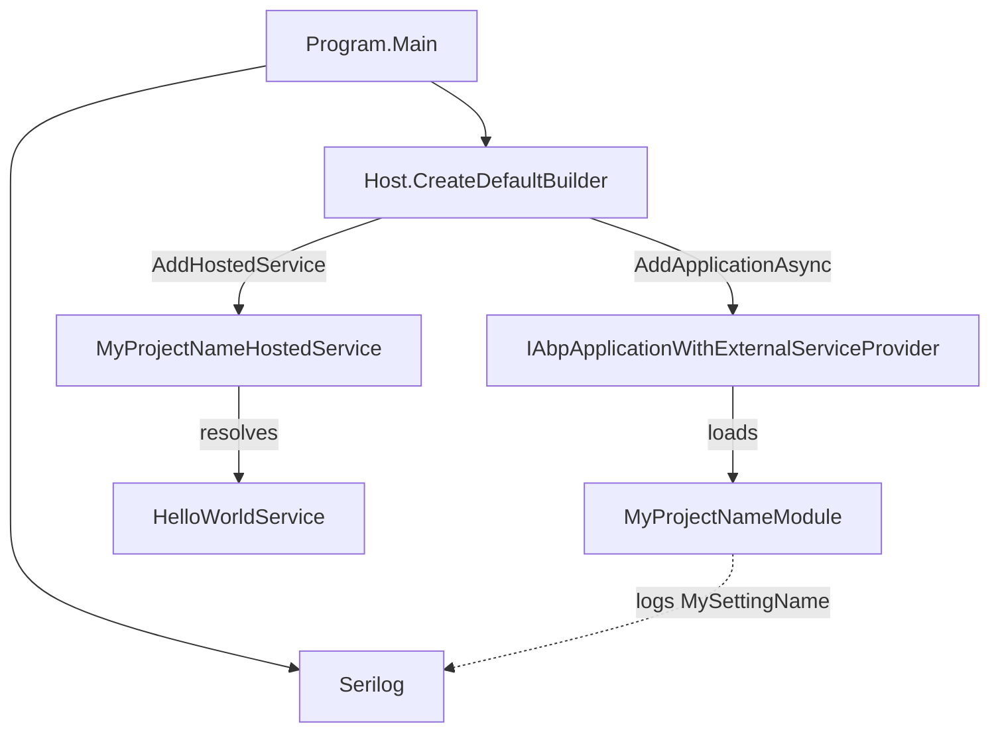

`templates/console/` is the **minimum viable ABP host**. It produces a single-project solution with one `.csproj`, an `AbpModule`, an `IHostedService`, an `ITransientDependency` demo service and a `Program.cs` that wires `Host.CreateDefaultBuilder` to ABP. No EF Core, no MVC, no UI — just the framework's modularity and dependency-injection bits.

Use it for batch jobs, CLI tools, long-running workers, daemons or "I want to learn the ABP module system without the noise" experiments. The same composition pattern shows up in the [`maui-template`](/templates/maui-template) and [`wpf-template`](/templates/wpf-template) — they all use `AbpApplicationFactory.CreateAsync<TStartupModule>`.

## Project tree

```text
templates/console/
├── MyCompanyName.MyProjectName.sln
├── common.props                     # TargetFramework, ABP version, Nullable=enable
└── src/
    └── MyCompanyName.MyProjectName/
        ├── MyCompanyName.MyProjectName.csproj
        ├── Program.cs
        ├── MyProjectNameModule.cs
        ├── MyProjectNameHostedService.cs
        ├── HelloWorldService.cs
        └── appsettings.json
```

That is the entire template. Verify with `find templates/console -type f`.

## Composition diagram



The `IAbpApplicationWithExternalServiceProvider` interface (`framework/src/Volo.Abp.Core/Volo/Abp/IAbpApplicationWithExternalServiceProvider.cs`) is ABP's way of attaching to a Microsoft Generic Host: ABP doesn't own the service provider — the .NET host does — and ABP just runs initialization/shutdown phases against it. The same pattern is what makes the console template safe to graduate into a more complex daemon later.

## Key files

### `Program.cs`

The shipped file builds Serilog, the generic host, registers the hosted service, registers the ABP application and initializes both:

```csharp
public class Program
{
    public async static Task<int> Main(string[] args)
    {
        Log.Logger = new LoggerConfiguration()
#if DEBUG
            .MinimumLevel.Debug()
#else
            .MinimumLevel.Information()
#endif
            .MinimumLevel.Override("Microsoft", LogEventLevel.Information)
            .Enrich.FromLogContext()
            .WriteTo.Async(c => c.File("Logs/logs.txt"))
            .WriteTo.Async(c => c.Console())
            .CreateLogger();

        try
        {
            Log.Information("Starting console host.");
            var builder = Host.CreateDefaultBuilder(args);
            builder.ConfigureServices(services =>
            {
                services.AddHostedService<MyProjectNameHostedService>();
                services.AddApplicationAsync<MyProjectNameModule>(options =>
                {
                    options.Services.ReplaceConfiguration(services.GetConfiguration());
                    options.Services.AddLogging(loggingBuilder => loggingBuilder.AddSerilog());
                });
            }).AddAppSettingsSecretsJson().UseAutofac().UseConsoleLifetime();

            var host = builder.Build();
            await host.Services
                .GetRequiredService<IAbpApplicationWithExternalServiceProvider>()
                .InitializeAsync(host.Services);

            await host.RunAsync();
            return 0;
        }
        catch (Exception ex)
        {
            if (ex is HostAbortedException) { throw; }
            Log.Fatal(ex, "Host terminated unexpectedly!");
            return 1;
        }
        finally
        {
            Log.CloseAndFlush();
        }
    }
}
```

Key points:

- `Host.CreateDefaultBuilder(args)` loads `appsettings.json`, env vars, command-line args.
- `AddAppSettingsSecretsJson()` is an ABP extension method (`framework/src/Volo.Abp.Core/Microsoft/Extensions/Hosting/AbpHostBuilderExtensions.cs`) that adds `appsettings.secrets.json` so you can keep dev secrets off disk.
- `UseAutofac()` is the call that swaps the default DI container with Autofac via `AbpAutofacModule` — required for ABP's module system to work.
- `UseConsoleLifetime()` makes Ctrl+C call `IHostApplicationLifetime.StopApplication()`, which triggers `MyProjectNameHostedService.StopAsync` → `IAbpApplicationWithExternalServiceProvider.ShutdownAsync`.

### `MyProjectNameModule.cs`

The shipped module:

```csharp
[DependsOn(typeof(AbpAutofacModule))]
public class MyProjectNameModule : AbpModule
{
    public override Task OnApplicationInitializationAsync(ApplicationInitializationContext context)
    {
        var logger = context.ServiceProvider.GetRequiredService<ILogger<MyProjectNameModule>>();
        var configuration = context.ServiceProvider.GetRequiredService<IConfiguration>();
        logger.LogInformation($"MySettingName => {configuration["MySettingName"]}");

        var hostEnvironment = context.ServiceProvider.GetRequiredService<IHostEnvironment>();
        logger.LogInformation($"EnvironmentName => {hostEnvironment.EnvironmentName}");

        return Task.CompletedTask;
    }
}
```

It depends on `AbpAutofacModule` only. The `OnApplicationInitializationAsync` override demonstrates how to read configuration from inside an ABP module — `appsettings.json` ships with a single key `MySettingName: "MySettingValue"` so you immediately see it logged on startup.

### `MyProjectNameHostedService.cs`

A standard `IHostedService` that calls the demo service then asks ABP to shut down:

```csharp
public class MyProjectNameHostedService : IHostedService
{
    private readonly IAbpApplicationWithExternalServiceProvider _abpApplication;
    private readonly HelloWorldService _helloWorldService;

    public MyProjectNameHostedService(
        HelloWorldService helloWorldService,
        IAbpApplicationWithExternalServiceProvider abpApplication)
    {
        _helloWorldService = helloWorldService;
        _abpApplication = abpApplication;
    }

    public async Task StartAsync(CancellationToken cancellationToken)
    {
        await _helloWorldService.SayHelloAsync();
    }

    public async Task StopAsync(CancellationToken cancellationToken)
    {
        await _abpApplication.ShutdownAsync();
    }
}
```

Replace `SayHelloAsync` with your real entry point — read a queue, process a file, run a background loop, etc.

### `HelloWorldService.cs`

A trivial `ITransientDependency` showing the convention-based DI:

```csharp
public class HelloWorldService : ITransientDependency
{
    public ILogger<HelloWorldService> Logger { get; set; } = NullLogger<HelloWorldService>.Instance;

    public Task SayHelloAsync()
    {
        Logger.LogInformation("Hello World!");
        return Task.CompletedTask;
    }
}
```

Because it implements `ITransientDependency`, the `AbpAutofacModule` registers it automatically — you don't add `services.AddTransient<HelloWorldService>()` anywhere. Use `ISingletonDependency` or `IScopedDependency` for the other lifetimes; see `framework/src/Volo.Abp.Core/Volo/Abp/DependencyInjection/`.

### `appsettings.json`

```json
{
  "MySettingName": "MySettingValue"
}
```

Edit freely — the `Program.cs` host builder reloads it on change.

### `MyCompanyName.MyProjectName.csproj`

```xml
<Project Sdk="Microsoft.NET.Sdk">
  <Import Project="..\..\common.props" />
  <PropertyGroup>
    <OutputType>Exe</OutputType>
    <TargetFramework>net7.0</TargetFramework>
    <Nullable>enable</Nullable>
  </PropertyGroup>
  <ItemGroup>
    <ProjectReference Include="..\..\..\..\framework\src\Volo.Abp.Autofac\Volo.Abp.Autofac.csproj" />
  </ItemGroup>
  <ItemGroup>
    <PackageReference Include="Microsoft.Extensions.Hosting" Version="7.0.0" />
    <PackageReference Include="Serilog.Extensions.Hosting" Version="4.2.0" />
    <PackageReference Include="Serilog.Extensions.Logging" Version="3.1.0" />
    <PackageReference Include="Serilog.Sinks.Async" Version="1.5.0" />
    <PackageReference Include="Serilog.Sinks.Console" Version="4.0.1" />
    <PackageReference Include="Serilog.Sinks.File" Version="5.0.0" />
  </ItemGroup>
  <ItemGroup>
    <Content Include="appsettings.json">
      <CopyToOutputDirectory>Always</CopyToOutputDirectory>
    </Content>
    <Content Include="appsettings.secrets.json" Condition="Exists('appsettings.secrets.json')">
      <CopyToOutputDirectory>Always</CopyToOutputDirectory>
    </Content>
  </ItemGroup>
</Project>
```

The in-monorepo template uses a `<ProjectReference>` to `framework/src/Volo.Abp.Autofac/`. The CLI rewrites this to a `<PackageReference Include="Volo.Abp.Autofac" Version="…" />` for end users.

## CLI usage

```bash
# Default — the only available shape
abp new Acme.Tool -t console

# With dotnet
dotnet new abp -t console -o ./Acme.Tool
```

No UI or DB flags apply.

## Post-create checklist

1. **Restore:** `dotnet restore`.
2. **Run:**
   ```bash
   cd src/Acme.Tool
   dotnet run
   ```
   Expected console output (excerpt):
   ```
   Starting console host.
   MySettingName => MySettingValue
   EnvironmentName => Development
   Hello World!
   ```
3. **Stop:** Ctrl+C — triggers `MyProjectNameHostedService.StopAsync` → `IAbpApplicationWithExternalServiceProvider.ShutdownAsync` → Serilog flush.

## Customisation hot-spots

- **Run forever.** Replace the body of `MyProjectNameHostedService.StartAsync` with a `Task.Run(async () => { while (!ct.IsCancellationRequested) { … await Task.Delay(…, ct); } }, cancellationToken)` (don't `await` the loop — `StartAsync` must return promptly).
- **Multiple services.** Add another `services.AddHostedService<…>()` in `Program.cs`. ABP starts them all in registration order.
- **Add a database.** Add `AbpEntityFrameworkCoreSqlServerModule` (or `AbpMongoDbModule`) to `[DependsOn(...)]`, register a `DbContext` via `context.Services.AddAbpDbContext<MyDbContext>(...)` inside `ConfigureServices`, and provide a connection string in `appsettings.json`.
- **Add background jobs.** Add `AbpBackgroundJobsAbstractionsModule` (and a backend like `AbpBackgroundJobsHangfireModule`) and inject `IBackgroundJobManager`.
- **Add scheduled tasks.** Add `AbpBackgroundWorkersModule`, derive from `BackgroundWorkerBase` or `AsyncPeriodicBackgroundWorkerBase`, and call `context.AddBackgroundWorkerAsync<MyWorker>()` from `OnApplicationInitializationAsync`.
- **Add event bus.** Add `AbpEventBusModule` and inject `IDistributedEventBus`/`ILocalEventBus`. The `Volo.Abp.EventBus.RabbitMQ` package gives you a distributed broker.
- **Read secrets from User Secrets.** Already wired via `AddAppSettingsSecretsJson()` — just `dotnet user-secrets set MySettingName "secret"` and re-run.
- **Add ABP CLI options.** `Host.CreateDefaultBuilder(args)` already binds CLI args to configuration, so `dotnet run -- --MySettingName=Override` works.

## Source map

| Concept | Path |
|---|---|
| Generic host bootstrap | `framework/src/Volo.Abp.Core/Microsoft/Extensions/DependencyInjection/ServiceCollectionApplicationExtensions.cs` (the `AddApplicationAsync<T>` extension). |
| `IAbpApplicationWithExternalServiceProvider` | `framework/src/Volo.Abp.Core/Volo/Abp/IAbpApplicationWithExternalServiceProvider.cs` |
| `AbpAutofacModule` | `framework/src/Volo.Abp.Autofac/Volo/Abp/Autofac/AbpAutofacModule.cs` |
| `AppSettings.Secrets` helper | `framework/src/Volo.Abp.Core/Microsoft/Extensions/Hosting/AbpHostBuilderExtensions.cs` |
| Lifetime semantics | `Volo.Abp.DependencyInjection.{ITransient,IScoped,ISingleton}Dependency` |

The same composition pattern in a GUI shell is shown by [`wpf-template`](/templates/wpf-template) and [`maui-template`](/templates/maui-template).
