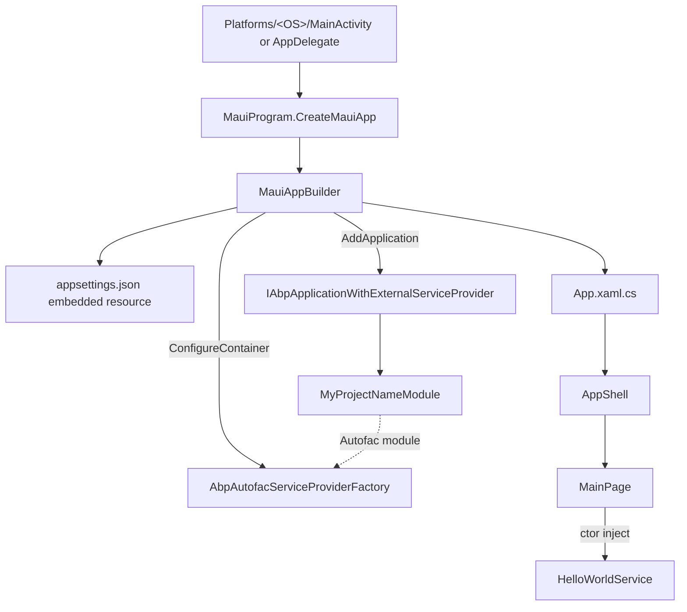

`templates/maui/` is a **single-project .NET MAUI 7 app** preconfigured to boot ABP from the MAUI host. It is the same composition pattern as [`console`](/templates/console-template) and [`wpf`](/templates/wpf-template) — `AbpAutofacModule` + `IAbpApplicationWithExternalServiceProvider` — adapted to MAUI's `MauiApp.CreateBuilder` and `AbpAutofacServiceProviderFactory`.

The template ships **one ABP module** (`MyProjectNameModule`), an embedded `appsettings.json`, a demo `HelloWorldService` injected into `MainPage`, and the standard MAUI navigation shell. There is no auth, no API client, no Sqlite-Net — just the ABP module system wired up. Add what you need on top.

## Project tree

```text
templates/maui/
├── MyCompanyName.MyProjectName.sln
├── common.props                              # ABP version, TargetFramework hints
└── src/
    └── MyCompanyName.MyProjectName/
        ├── MyCompanyName.MyProjectName.csproj  # multi-TFM: net7.0-android/ios/maccatalyst/windows
        ├── MauiProgram.cs                      # MAUI builder + ABP wiring
        ├── App.xaml + App.xaml.cs              # MAUI Application
        ├── AppShell.xaml + AppShell.xaml.cs    # MAUI Shell
        ├── MainPage.xaml + MainPage.xaml.cs    # Sample page (counter + greeting)
        ├── MyProjectNameModule.cs              # The ABP startup module
        ├── HelloWorldService.cs                # ITransientDependency demo
        ├── appsettings.json                    # { "AppName": "MyProjectName" }
        ├── Platforms/
        │   ├── Android/
        │   ├── iOS/
        │   ├── MacCatalyst/
        │   ├── Tizen/
        │   └── Windows/
        ├── Properties/
        └── Resources/
            ├── AppIcon/                # appicon.svg + foreground
            ├── Splash/splash.svg
            ├── Images/dotnet_bot.svg
            ├── Fonts/OpenSans-*.ttf
            ├── Raw/
            └── Styles/{Colors,Styles}.xaml
```

Verify with `ls templates/maui/src/MyCompanyName.MyProjectName/`.

## Composition diagram



## Key files

### `MauiProgram.cs`

The shipped file is the heart of the integration:

```csharp
public static class MauiProgram
{
    public static MauiApp CreateMauiApp()
    {
        var builder = MauiApp.CreateBuilder();
        builder
            .UseMauiApp<App>()
            .ConfigureFonts(fonts =>
            {
                fonts.AddFont("OpenSans-Regular.ttf", "OpenSansRegular");
                fonts.AddFont("OpenSans-Semibold.ttf", "OpenSansSemibold");
            })
            .ConfigureContainer(new AbpAutofacServiceProviderFactory(new Autofac.ContainerBuilder()));

        ConfigureConfiguration(builder);

        builder.Services.AddApplication<MyProjectNameModule>(options =>
        {
            options.Services.ReplaceConfiguration(builder.Configuration);
        });

        var app = builder.Build();

        app.Services
           .GetRequiredService<IAbpApplicationWithExternalServiceProvider>()
           .Initialize(app.Services);

        return app;
    }

    private static void ConfigureConfiguration(MauiAppBuilder builder)
    {
        var assembly = typeof(App).GetTypeInfo().Assembly;
        builder.Configuration.AddJsonFile(
            new EmbeddedFileProvider(assembly),
            "appsettings.json", optional: false, false);
    }
}
```

Notable bits:

- `ConfigureContainer(new AbpAutofacServiceProviderFactory(...))` is the MAUI hook that replaces the default `ServiceCollection` builder with Autofac. Without it ABP's modularity won't initialise.
- `builder.Services.AddApplication<MyProjectNameModule>(...)` is ABP's "I'm hosted externally" entry point — it registers `IAbpApplicationWithExternalServiceProvider` against the MAUI service collection.
- `Initialize(app.Services)` runs the module pipeline (`OnPreApplicationInitialization`, `OnApplicationInitialization`, `OnPostApplicationInitialization`).
- `appsettings.json` is loaded from an **embedded resource** because MAUI apps don't have a writable working directory on iOS/Android. The csproj marks it `<EmbeddedResource Include="appsettings.json" />`.

### `MyProjectNameModule.cs`

Trivial:

```csharp
[DependsOn(typeof(AbpAutofacModule))]
public class MyProjectNameModule : AbpModule
{
}
```

Override `ConfigureServices` to add HTTP client, dynamic proxies, etc. (see customisation hot-spots below).

### `MainPage.xaml.cs`

Demonstrates ABP DI through the MAUI page constructor:

```csharp
public partial class MainPage : ContentPage, ISingletonDependency
{
    private readonly HelloWorldService _helloWorldService;
    int count = 0;

    public MainPage(HelloWorldService helloWorldService)
    {
        _helloWorldService = helloWorldService;
        InitializeComponent();
        SetHelloLabText();
    }

    private void SetHelloLabText() => HelloLab.Text = _helloWorldService.SayHello();
}
```

`MainPage` is marked `ISingletonDependency` so ABP/Autofac register it; the MAUI shell resolves it through the same Autofac container.

### `HelloWorldService.cs`

The same trivial demo as the console template:

```csharp
public class HelloWorldService : ITransientDependency
{
    public string SayHello() => "Hello, World!";
}
```

### `appsettings.json`

```json
{
  "AppName": "MyProjectName"
}
```

The placeholder is rewritten to your project name by the CLI. Reach it from anywhere via `IConfiguration` (`context.ServiceProvider.GetRequiredService<IConfiguration>()["AppName"]`).

### `MyCompanyName.MyProjectName.csproj`

Multi-target:

```xml
<TargetFrameworks>net7.0-android;net7.0-ios;net7.0-maccatalyst</TargetFrameworks>
<TargetFrameworks Condition="$([MSBuild]::IsOSPlatform('windows'))">$(TargetFrameworks);net7.0-windows10.0.19041.0</TargetFrameworks>
```

Plus a commented-out Tizen TFM (`net7.0-tizen`) that you can uncomment after installing the Tizen toolchain. ABP-specific bits:

```xml
<ProjectReference Include="..\..\..\..\framework\src\Volo.Abp.Autofac\Volo.Abp.Autofac.csproj" />
<PackageReference Include="Microsoft.Extensions.FileProviders.Embedded" Version="7.0.10" />
```

`appsettings.json` is included as `<EmbeddedResource>`. App icon (`Resources/AppIcon/appicon.svg`, color `#512BD4`) and splash (`Resources/Splash/splash.svg`) wire the standard MAUI asset pipeline.

## CLI usage

```bash
abp new Acme.BookStore.Mobile -t maui
# or
dotnet new abp -t maui -o ./Acme.BookStore.Mobile
```

No `-u` / `-d` flags apply.

## Post-create checklist

1. **Install the MAUI workload** (one-time per machine):
   ```bash
   dotnet workload install maui
   ```
2. **Restore + build:**
   ```bash
   dotnet restore
   dotnet build
   ```
3. **Run on a target:**
   ```bash
   # Android (an emulator must be running)
   dotnet build -t:Run -f net7.0-android

   # iOS simulator (macOS only)
   dotnet build -t:Run -f net7.0-ios

   # Mac Catalyst
   dotnet build -t:Run -f net7.0-maccatalyst

   # WinUI 3 (Windows)
   dotnet build -t:Run -f net7.0-windows10.0.19041.0
   ```
4. **Verify ABP started.** The `MainPage` `HelloLab` shows `Hello, World!` after `Initialize` runs. If the label remains `Loading...`, check the device log — `Initialize` threw and MAUI fell back without DI.

## Customisation hot-spots

- **Add HTTP API clients.** Add `AbpHttpClientModule` to `[DependsOn]` and call `context.Services.AddHttpClientProxies(...)` to consume an ABP backend's `HttpApi.Client` package. Configure the base URL via `RemoteServiceOptions` in `appsettings.json`.
- **Authentication.** MAUI's `WebAuthenticator` can complete an OAuth code+PKCE flow against the ABP `AuthServer`. Store the token in `SecureStorage` and inject it via a delegating `HttpMessageHandler` in your HTTP client config.
- **Local persistence.** Drop in `sqlite-net-pcl` or `Microsoft.EntityFrameworkCore.Sqlite` and add a thin `AbpModule` that registers your `DbContext`.
- **Page DI.** Mark each `ContentPage` with `ISingletonDependency` (like `MainPage` is) and inject services through the constructor. The Autofac container resolves them automatically when Shell navigates to the page.
- **Localization.** Add `AbpLocalizationModule` and embed your JSON resources into a `Localization/` folder marked as `<EmbeddedResource>`.
- **App identifier and version.** Edit the csproj `<ApplicationId>`, `<ApplicationIdGuid>`, `<ApplicationDisplayVersion>`, `<ApplicationVersion>` and the icon under `Resources/AppIcon/` for release builds.
- **Tizen.** Uncomment the `net7.0-tizen` TFM in the csproj and follow [Samsung's setup guide](https://github.com/Samsung/Tizen.NET).

## Lifecycle gotchas

- `appsettings.json` **must** be embedded — file system access in `Platforms/Android/MainActivity.cs` won't find a loose copy. The `EmbeddedFileProvider` in `ConfigureConfiguration` is mandatory.
- `Initialize(app.Services)` is synchronous on MAUI (no `await`), so any async startup work must run inside `OnApplicationInitializationAsync` on the module — MAUI/Autofac will block until it returns. Keep it lean to keep startup snappy on Android.
- On Android the process is recycled aggressively. There is no automatic `ShutdownAsync()` call — if you need it, hook `Application.Current.OnSleep` and `OnResume` and call `app.Services.GetRequiredService<IAbpApplicationWithExternalServiceProvider>().ShutdownAsync()` explicitly.

## Source map

| Concept | Path |
|---|---|
| Composition root | `MauiProgram.cs` |
| ABP startup module | `MyProjectNameModule.cs` |
| Demo service | `HelloWorldService.cs` |
| MAUI Application/Shell/Page | `App.xaml(.cs)`, `AppShell.xaml(.cs)`, `MainPage.xaml(.cs)` |
| MAUI assets | `Resources/AppIcon`, `Resources/Splash`, `Resources/Fonts` |
| Configuration | `appsettings.json` (embedded resource) |
| Autofac integration | `framework/src/Volo.Abp.Autofac/Volo/Abp/Autofac/AbpAutofacServiceProviderFactory.cs` |

For the desktop sibling see [`wpf-template`](/templates/wpf-template); for the headless equivalent see [`console-template`](/templates/console-template).

## Per-platform entry points

MAUI is multi-targeted; every platform has its own bootstrap file under `Platforms/`. The shipped scaffolds are:

| Platform folder | Entry file | Role |
|---|---|---|
| `Platforms/Android/` | `MainActivity.cs`, `MainApplication.cs`, `AndroidManifest.xml` | Android app entry — `MainApplication.CreateMauiApp` calls `MauiProgram.CreateMauiApp`. |
| `Platforms/iOS/` | `AppDelegate.cs`, `Program.cs`, `Info.plist` | iOS app entry — `AppDelegate.CreateMauiApp` does the same. |
| `Platforms/MacCatalyst/` | `AppDelegate.cs`, `Program.cs`, `Info.plist` | Mac Catalyst variant. |
| `Platforms/Windows/` | `App.xaml(.cs)`, `Package.appxmanifest`, `app.manifest` | WinUI 3 entry. |
| `Platforms/Tizen/` | `Main.cs`, `tizen-manifest.xml` | Optional — uncomment the TFM to enable. |

You usually do **not** edit these files — the only reason to do so is to register platform-specific permissions (camera, geolocation) or services. ABP services are platform-agnostic and live above this layer.

## Resource pipeline

```text
Resources/
├── AppIcon/
│   ├── appicon.svg          # MauiIcon Color="#512BD4"
│   └── appiconfg.svg        # Foreground for adaptive icons
├── Splash/
│   └── splash.svg           # MauiSplashScreen Color="#512BD4" BaseSize="128,128"
├── Images/
│   ├── dotnet_bot.svg
│   └── …                    # MauiImage glob
├── Fonts/
│   └── OpenSans-*.ttf       # MauiFont glob, registered in MauiProgram.ConfigureFonts
├── Raw/                     # MauiAsset — accessed via FileSystem.OpenAppPackageFileAsync
└── Styles/
    ├── Colors.xaml
    └── Styles.xaml          # Referenced from App.xaml ResourceDictionary
```

To use an asset from code:

```csharp
using var stream = await FileSystem.OpenAppPackageFileAsync("myfile.json");
```

For raster image overrides per platform, drop platform-specific versions under `Resources/Images/` with the `<MauiImage Update="…" Resize="false" />` form.

## Hot reload + DI quirk

XAML Hot Reload works out of the box but **page constructors are called once** when the singleton is registered. If you change `MainPage.xaml.cs` constructor signatures during hot reload, MAUI's container reflection may surface a "cannot construct" error — restart the app. Hot reload for XAML markup itself is unaffected.
