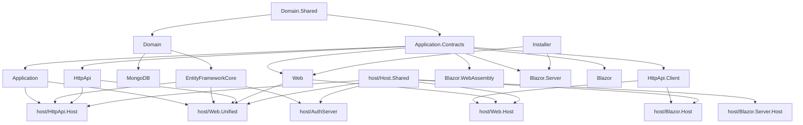

`templates/module/` is the scaffold the CLI uses when you run `abp new MyCompanyName.MyProductName -t module`. Unlike the application templates, the output is **not** an end-user product. It is a fan of class libraries that ship as NuGet packages and a set of "host" runners that let you smoke-test the module locally before publishing.

The same layered shape that the [`app` template](/templates/app-aspnet-core) uses for an end-user app is applied here to a reusable bounded context. ABP's first-party modules (`Volo.Abp.Identity`, `Volo.Abp.TenantManagement`, `Volo.Abp.Cms.Kit`, …) under `modules/` of this monorepo are structured the same way.

## Folder layout

```text
templates/module/
├── aspnet-core/
│   ├── MyCompanyName.MyProjectName.sln
│   ├── MyCompanyName.MyProjectName.abpmdl.json      # module manifest used by `abp` CLI
│   ├── MyCompanyName.MyProjectName.abpsln.json      # solution manifest
│   ├── NuGet.Config
│   ├── common.props
│   ├── docker-compose.yml                           # SQL Server + extras for the host runners
│   ├── docker-compose.override.yml
│   ├── docker-compose.migrations.yml
│   ├── database/                                    # Dockerfile + entrypoint for SQL bootstrap
│   ├── src/                                         # 13 library projects
│   ├── host/                                        # 7 runner projects
│   └── test/                                        # 6 test projects
└── angular/                                         # ng-packagr workspace for the @abp-ng module
```

### `src/` — the libraries

```text
src/
├── MyCompanyName.MyProjectName.Domain.Shared/
├── MyCompanyName.MyProjectName.Domain/
├── MyCompanyName.MyProjectName.Application.Contracts/
├── MyCompanyName.MyProjectName.Application/
├── MyCompanyName.MyProjectName.EntityFrameworkCore/
├── MyCompanyName.MyProjectName.MongoDB/
├── MyCompanyName.MyProjectName.HttpApi/
├── MyCompanyName.MyProjectName.HttpApi.Client/
├── MyCompanyName.MyProjectName.Installer/           # exposes JS/CSS/img embedded resources
├── MyCompanyName.MyProjectName.Web/                 # MVC views + tag helpers
├── MyCompanyName.MyProjectName.Blazor/              # Blazor WebAssembly components
├── MyCompanyName.MyProjectName.Blazor.Server/       # Blazor Server components
└── MyCompanyName.MyProjectName.Blazor.WebAssembly/  # WASM startup glue
```

Each project ships a `<Name>.abppkg.json`, a `<Name>.csproj` and an `Abp*Module` class. The `abppkg.json` files are what the ABP CLI reads to publish to NuGet — they describe the package name, dependencies and content.

### `host/` — the runner projects

```text
host/
├── MyCompanyName.MyProjectName.AuthServer/          # Separated auth host (tiered scenario)
├── MyCompanyName.MyProjectName.HttpApi.Host/        # REST API runner
├── MyCompanyName.MyProjectName.Web.Host/            # MVC runner against remote APIs
├── MyCompanyName.MyProjectName.Web.Unified/         # Single-process MVC + API + auth
├── MyCompanyName.MyProjectName.Blazor.Host/         # Blazor WebAssembly host
├── MyCompanyName.MyProjectName.Blazor.Server.Host/  # Blazor Server runner
└── MyCompanyName.MyProjectName.Host.Shared/         # MultiTenancy/* and other shared utilities
```

These are **not** shipped as NuGet packages. They exist so that a contributor cloning the source can `dotnet run` against an example host without bringing the module into a third-party app.

### `test/` — the test projects

```text
test/
├── MyCompanyName.MyProjectName.TestBase/
├── MyCompanyName.MyProjectName.Domain.Tests/
├── MyCompanyName.MyProjectName.Application.Tests/
├── MyCompanyName.MyProjectName.EntityFrameworkCore.Tests/
├── MyCompanyName.MyProjectName.MongoDB.Tests/
└── MyCompanyName.MyProjectName.HttpApi.Client.ConsoleTestApp/
```

### `angular/` — the matching ng module

`ng-packagr` workspace. The library lives under `projects/my-project-name/` and is consumed by end users as `@my-company-name/my-project-name`.

Verify the tree with `ls templates/module/aspnet-core/{src,host,test}` and `cat templates/module/aspnet-core/MyCompanyName.MyProjectName.abpmdl.json`.

## Dependency graph



The `src/` libraries mirror the `app` shape exactly — `Domain.Shared` is the substrate, `Domain` adds `AbpDddDomainModule`, `Application.Contracts` adds the public DTOs/permissions, `Application` implements them. The Installer module exposes embedded JS/CSS via `Volo.Abp.VirtualFileSystem` so consumers' bundling pipelines can pick them up.

## Module class samples

### `MyProjectNameDomainModule.cs`

```csharp
[DependsOn(
    typeof(AbpDddDomainModule),
    typeof(MyProjectNameDomainSharedModule)
)]
public class MyProjectNameDomainModule : AbpModule
{
}
```

This is intentionally minimal — module authors add their own dependencies (e.g. `Volo.Abp.Identity` if the module extends users).

### `MyProjectNameApplicationModule.cs`

```csharp
[DependsOn(
    typeof(MyProjectNameDomainModule),
    typeof(MyProjectNameApplicationContractsModule),
    typeof(AbpDddApplicationModule),
    typeof(AbpAutoMapperModule)
)]
public class MyProjectNameApplicationModule : AbpModule
{
    public override void ConfigureServices(ServiceConfigurationContext context)
    {
        context.Services.AddAutoMapperObjectMapper<MyProjectNameApplicationModule>();
        Configure<AbpAutoMapperOptions>(options =>
        {
            options.AddMaps<MyProjectNameApplicationModule>(validate: true);
        });
    }
}
```

### `MyProjectNameDbContext.cs`

```csharp
[ConnectionStringName(MyProjectNameDbProperties.ConnectionStringName)]
public class MyProjectNameDbContext : AbpDbContext<MyProjectNameDbContext>, IMyProjectNameDbContext
{
    public MyProjectNameDbContext(DbContextOptions<MyProjectNameDbContext> options) : base(options) { }

    protected override void OnModelCreating(ModelBuilder builder)
    {
        base.OnModelCreating(builder);
        builder.ConfigureMyProjectName();
    }
}
```

The companion `MyProjectNameDbContextModelCreatingExtensions.ConfigureMyProjectName` lives next to it and is where the module's tables/indexes are declared with the shared `DbTablePrefix` and `DbSchema` constants from `MyProjectNameDbProperties.cs`. The pattern lets consumers also include the module's entities in their own `DbContext` by calling `ConfigureMyProjectName(...)` from their `OnModelCreating`.

### `MyProjectNameInstallerModule.cs`

```csharp
[DependsOn(typeof(AbpVirtualFileSystemModule))]
public class MyProjectNameInstallerModule : AbpModule
{
    public override void ConfigureServices(ServiceConfigurationContext context)
    {
        Configure<AbpVirtualFileSystemOptions>(options =>
        {
            options.FileSets.AddEmbedded<MyProjectNameInstallerModule>();
        });
    }
}
```

The Installer project lets you ship CSS/JS/image bundles inside the NuGet package — consumers pull them into their bundle pipeline by depending on it.

## Manifest files

### `MyCompanyName.MyProjectName.abpmdl.json`

Describes the module as a logical unit (used by `abp` CLI commands `abp install` / `abp add-module`). Lists every package with its on-disk path and the folder ("src", "host" or "test") it sits in. Example excerpt from the shipped file:

```json
{
  "folders": { "items": { "src": {}, "test": {}, "host": {} } },
  "packages": {
    "MyCompanyName.MyProjectName.Domain.Shared": {
      "path": "src/MyCompanyName.MyProjectName.Domain.Shared/MyCompanyName.MyProjectName.Domain.Shared.abppkg.json",
      "folder": "src"
    },
    "MyCompanyName.MyProjectName.Domain": { … },
    "MyCompanyName.MyProjectName.Application.Contracts": { … },
    "MyCompanyName.MyProjectName.Application": { … },
    "MyCompanyName.MyProjectName.EntityFrameworkCore": { … },
    "MyCompanyName.MyProjectName.MongoDB": { … },
    "MyCompanyName.MyProjectName.HttpApi": { … },
    "MyCompanyName.MyProjectName.HttpApi.Client": { … },
    "MyCompanyName.MyProjectName.Web": { … },
    "MyCompanyName.MyProjectName.Blazor": { … },
    "MyCompanyName.MyProjectName.Blazor.Server": { … },
    "MyCompanyName.MyProjectName.Blazor.WebAssembly": { … },
    "MyCompanyName.MyProjectName.HttpApi.Host": { … },
    "MyCompanyName.MyProjectName.AuthServer": { … },
    "MyCompanyName.MyProjectName.Web.Host": { … },
    "MyCompanyName.MyProjectName.Web.Unified": { … },
    "MyCompanyName.MyProjectName.Blazor.Host": { … },
    "MyCompanyName.MyProjectName.Blazor.Server.Host": { … },
    "MyCompanyName.MyProjectName.Host.Shared": { … },
    "MyCompanyName.MyProjectName.TestBase": { … },
    "MyCompanyName.MyProjectName.Domain.Tests": { … },
    "MyCompanyName.MyProjectName.Application.Tests": { … },
    "MyCompanyName.MyProjectName.EntityFrameworkCore.Tests": { … },
    "MyCompanyName.MyProjectName.MongoDB.Tests": { … },
    "MyCompanyName.MyProjectName.HttpApi.Client.ConsoleTestApp": { … }
  }
}
```

### `MyCompanyName.MyProjectName.abpsln.json`

A trivial wrapper that points at the module manifest:

```json
{
  "modules": {
    "MyCompanyName.MyProjectName": { "path": "MyCompanyName.MyProjectName.abpmdl.json" }
  }
}
```

When a consumer runs `abp add-module MyCompanyName.MyProjectName -s ./AcmeApp.sln`, the CLI loads these manifests to know which `.csproj`s to drop into the consumer's solution.

## CLI usage

```bash
# Generate the module
abp new MyCompany.MyModule -t module

# Generate inside a specific solution folder
abp new MyCompany.MyModule -t module -o ./modules

# Add the generated module to an existing app solution
abp add-module MyCompany.MyModule -s ./Acme.BookStore/aspnet-core/Acme.BookStore.sln
```

The `module` template ignores `-u` and `-d` flags — both EF Core and MongoDB libraries are always produced, and every UI shape (MVC, Blazor Server, Blazor WebAssembly) ships.

## Post-create checklist

1. **Restore + build:**
   ```bash
   dotnet restore
   dotnet build
   ```
2. **Choose a host to smoke-test the module:**
   - `host/MyCompanyName.MyProjectName.Web.Unified/` — MVC + API + Auth in one process.
   - `host/MyCompanyName.MyProjectName.HttpApi.Host/` + `host/MyCompanyName.MyProjectName.AuthServer/` — tiered.
   - `host/MyCompanyName.MyProjectName.Blazor.Server.Host/` — Blazor Server runner.
   - `host/MyCompanyName.MyProjectName.Blazor.Host/` — Blazor WebAssembly hosted by an API.
3. **Bring up dependencies with Docker Compose** (SQL Server, optionally Redis):
   ```bash
   docker compose -f docker-compose.yml -f docker-compose.override.yml up -d
   ```
   The migrations compose file (`docker-compose.migrations.yml`) provides a one-shot container that runs schema migrations via the `database/Dockerfile` and `database/entrypoint.sh`.
4. **Install client libraries** in the chosen host:
   ```bash
   abp install-libs
   ```
5. **Run the host:** `dotnet run` from `host/.../<Runner>/`. Standard ports come from `Properties/launchSettings.json`.
6. **Run tests:** `dotnet test`. The test base spins up SQLite in memory for EF Core tests and Mongo2Go for the Mongo tests.
7. **Pack for release:**
   ```bash
   dotnet pack -c Release -o ./artifacts
   ```
   The resulting `.nupkg` files take their version from `common.props` (the same property the rest of the monorepo uses).

## Customisation hot-spots

- **Pick the right module class to extend.** Add `[DependsOn(typeof(AbpIdentityDomainModule))]` to `MyProjectNameDomainModule` if your entities reference identity users; add the matching `*.EntityFrameworkCore` module dependency to `MyProjectNameEntityFrameworkCoreModule`. Keep the layering intact — host runners don't extend domain semantics.
- **Wire your DbContext into consumer apps.** Document that consumers should call `ConfigureMyProjectName()` from their own `OnModelCreating` if they want a shared `DbContext`. Use `[ConnectionStringName(MyProjectNameDbProperties.ConnectionStringName)]` consistently.
- **Expose UI assets.** Drop CSS/JS under `Installer/wwwroot/` and they'll be served as embedded resources to any consumer that depends on `MyProjectNameInstallerModule`.
- **Module-scoped permissions.** Declare them in `Application.Contracts/Permissions/MyProjectNamePermissions.cs` and `MyProjectNamePermissionDefinitionProvider.cs`.
- **Angular library.** Edit `angular/projects/my-project-name/` and publish with `npm run build:lib && npm publish`.
- **Versioning.** All NuGet packages share `common.props` — bump `<Version>` once for the whole module.
- **Docker.** `docker-compose.yml` and the `database/` directory let you ship a reproducible local dev environment together with the module source.

## Source map

| Concept | Path |
|---|---|
| Module manifest | `templates/module/aspnet-core/MyCompanyName.MyProjectName.abpmdl.json` |
| Per-package manifest | `src/.../*.abppkg.json` |
| Module Db conventions | `src/.../EntityFrameworkCore/MyProjectNameDbContextModelCreatingExtensions.cs` |
| DB constants (table prefix + schema + connection string name) | `src/.../Domain/MyProjectNameDbProperties.cs` |
| Embedded resource gateway | `src/.../Installer/MyProjectNameInstallerModule.cs` |
| First-party examples following the same shape | `modules/identity/`, `modules/cms-kit/`, `modules/blogging/` … |

For end-user apps consuming a generated module, scaffold the host with [`app-aspnet-core`](/templates/app-aspnet-core) and run `abp add-module` against it.
