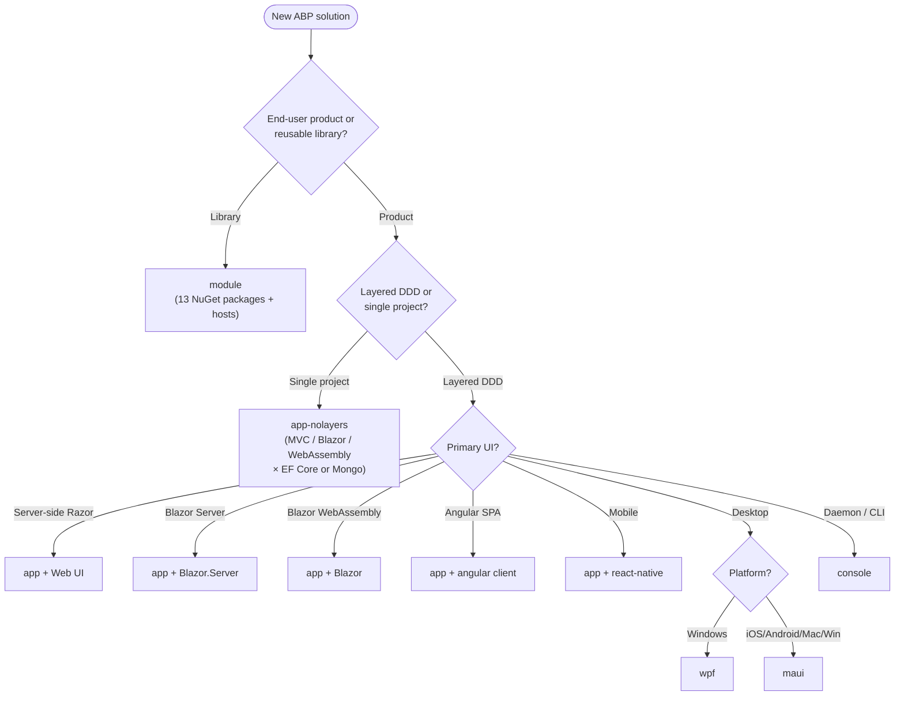

The `templates/` folder of the `abpframework/abp` monorepo contains the **canonical scaffolds** that the ABP CLI (`abp new` / `dotnet new abp`) materialises when you create a new solution. Each template is a fully working solution stored under a placeholder name `MyCompanyName.MyProjectName` — the CLI string-replaces the placeholder with the name the user passes on the command line, optionally removes UI/database variants the user did not select, and copies the result to the target folder. Because templates are stored as real, buildable solutions, every page in this section can point at concrete files in `templates/` rather than at generator code.

## Inventory

The on-disk layout is:

```text
templates/
├── NuGet.Config
├── app/                     # The full DDD solution template
│   ├── angular/             # Angular SPA client
│   ├── aspnet-core/         # 17-project DDD backend + MVC/Blazor UIs
│   └── react-native/        # Expo-based mobile client
├── app-nolayers/            # Single-project "no layers" starter
│   ├── angular/
│   └── aspnet-core/         # 7 variants: Host/Mvc/Blazor.Server + .Mongo
├── console/                 # Minimal console host + AbpModule
├── maui/                    # .NET MAUI cross-platform shell
├── module/                  # Reusable module / library template
│   ├── angular/
│   └── aspnet-core/         # 13 src + 7 host + 6 test projects
└── wpf/                     # WPF desktop shell
```

The eight templates split into three groups by intent:

| Group | Templates | Purpose |
|---|---|---|
| Application solutions | `app`, `app-nolayers` | End-user products. Ship with Identity, OpenIddict, tenant management, settings, audit logging. |
| Client-only | `app/angular`, `app/react-native` | Front-end shells that talk to the `app` backend over HTTP. |
| Single-process hosts | `console`, `maui`, `wpf` | Minimal ABP hosts for non-web scenarios — share the same `AbpModule`/`IAbpApplication` model. |
| Library | `module` | A reusable ABP module published as NuGet packages. Mirrors the layered shape of `app` but produces class libraries plus optional host projects. |

## Choosing a template



## CLI invocation

The CLI exposes each template by a short name. The list below matches the `<template>` argument accepted by `abp new` (and the equivalent `dotnet new abp -t <name>` form):

| Template | CLI name | UI variants | Database variants |
|---|---|---|---|
| `app/aspnet-core` | `app` | `mvc` (default), `blazor`, `blazor-server`, `angular`, `none` | `ef` (default), `mongodb` |
| `app-nolayers/aspnet-core` | `app-nolayers` | `mvc`, `blazor`, `blazor-server`, `none` | `ef`, `mongodb` |
| `module` | `module` | n/a (libraries) — produces full layer set | EF Core + MongoDB always |
| `console` | `console` | n/a | n/a |
| `maui` | `maui` | n/a | n/a |
| `wpf` | `wpf` | n/a | n/a |

A typical create command for the flagship `app` template:

```bash
abp new Acme.BookStore \
  -t app \
  -u mvc \
  -d ef \
  --mobile react-native \
  -csf
```

| Flag | Meaning |
|---|---|
| `-t app` | Select solution template (`app`, `app-nolayers`, `module`, `console`, `maui`, `wpf`). |
| `-u mvc` | UI framework — `mvc`, `blazor`, `blazor-server`, `angular`, `none`. |
| `-d ef` | Database provider — `ef` (Entity Framework Core, SQL Server by default) or `mongodb`. |
| `--mobile react-native` | Add a mobile client — `react-native` or `none`. Only valid for `app`. |
| `-csf` | Create solution folder. Puts the solution inside `./Acme.BookStore/`. |
| `-o ./path` | Output folder (defaults to current). |
| `--no-ui` | Equivalent to `-u none` — produces a headless API host. |
| `--separate-auth-server` | Use the `AuthServer` project as a separate identity host. |
| `--tiered` | Generate the tiered variant (separate `HttpApi.Host` + `Web`). |

The `dotnet new` form (after `dotnet new --install Volo.Abp.Templates` or via the `abp` CLI internals) is interchangeable:

```bash
dotnet new abp -t app -u angular -d mongodb -o ./Acme.BookStore
```

## What every template ships

Every template — regardless of size — has these common pieces:

| File | Role |
|---|---|
| `common.props` | Shared MSBuild properties: `<TargetFramework>net7.0</TargetFramework>`, `<LangVersion>latest</LangVersion>`, `<Nullable>` policy, ABP version. Imported by every `.csproj` via `<Import Project="..\..\common.props" />`. |
| `NuGet.Config` | Pins the package source list. In the in-repo templates it adds a `MyGet` pre-release feed; the CLI rewrites this for end users. |
| `MyCompanyName.MyProjectName.sln` | Visual Studio solution file. Project paths use the placeholder. |
| `appsettings.json` / `appsettings.Development.json` | ASP.NET Core configuration. Templates ship development connection strings to `localhost\SQLEXPRESS` and `mongodb://localhost:27017`. |
| At least one `[DependsOn]` `AbpModule` | The ABP module system entry point. See `framework/Volo.Abp.Core` for the module abstraction. |

The placeholders the CLI rewrites are:

- `MyCompanyName` → company segment of the solution name (defaults to `MyCompanyName` if no `.` in the name).
- `MyProjectName` → project segment (everything after the first `.`).
- `MyCompanyName.MyProjectName` → full solution name.
- File names, folder names, namespaces, csproj contents and string literals (`"MyProjectName"` audience IDs, etc.) are all rewritten.

## Page-by-page

The remaining pages in this section drill into each template:

| Page | What it covers |
|---|---|
| [`app-aspnet-core`](/templates/app-aspnet-core) | The 17-project DDD backend: Domain.Shared → Domain → Application.Contracts → Application, EF Core and MongoDB siblings, HTTP API, MVC/Blazor UIs, AuthServer, DbMigrator. |
| [`app-angular`](/templates/app-angular) | Angular 16 SPA wired against `@abp/ng.*` packages and consumes the `HttpApi.Host`. |
| [`app-react-native`](/templates/app-react-native) | Expo / React Native 0.70 client with Redux Toolkit, axios interceptors, and ABP OAuth login flow. |
| [`app-nolayers`](/templates/app-nolayers) | The single-project alternative. Seven runnable variants (MVC, Blazor Server, Blazor WebAssembly) × (EF, Mongo). |
| [`console-template`](/templates/console-template) | The smallest ABP host — `Host.CreateDefaultBuilder` + `IAbpApplicationWithExternalServiceProvider`. |
| [`module-template`](/templates/module-template) | The reusable module template: 13 layered libraries, 7 host runners, 6 test projects, NuGet packaging. |
| [`maui-template`](/templates/maui-template) | .NET MAUI app that calls `AbpAutofacServiceProviderFactory` to plug ABP into the MAUI host. |
| [`wpf-template`](/templates/wpf-template) | WPF desktop shell hosting `AbpApplicationFactory.CreateAsync` from `App.xaml.cs`. |

## Source map

| Concept | Path |
|---|---|
| Template root | `templates/` |
| CLI command that consumes templates | `framework/src/Volo.Abp.Cli.Core/Volo/Abp/Cli/ProjectBuilding/` |
| Template package zip producer | `framework/src/Volo.Abp.Cli.Core/Volo/Abp/Cli/Bundling/` |
| Module abstraction used by every template | `framework/src/Volo.Abp.Core/Volo/Abp/Modularity/` |
| `IAbpApplication` factories | `framework/src/Volo.Abp.Core/Volo/Abp/AbpApplicationFactory.cs` |
| Autofac container hook used by app/console/maui/wpf | `framework/src/Volo.Abp.Autofac/` |

Use the per-template pages for project trees, dependency graphs and post-create checklists.

## How the CLI consumes a template

The `abp new` command does not invent code — it pipes the `templates/` folder contents through a string-replacement and pruning pipeline before copying them to the user's filesystem. The pipeline lives in `framework/src/Volo.Abp.Cli.Core/Volo/Abp/Cli/ProjectBuilding/`:

1. **Resolve the template.** `TemplateInfoProvider` resolves the short name (`app`, `app-nolayers`, `module`, `console`, `maui`, `wpf`) to the on-disk folder.
2. **Pack into a zip.** During release builds the templates are bundled into NuGet packages (`Volo.Abp.Templates.*.nupkg`). The CLI downloads the matching version (`-v 7.4.0`) and unpacks it.
3. **Replace placeholders.** `ProjectNameReplacer` rewrites:
   - `MyCompanyName.MyProjectName` → full solution name (e.g. `Acme.BookStore`).
   - `MyCompanyName` → company segment.
   - `MyProjectName` → project segment.
   - Inside file paths, csproj contents, namespaces, string literals and JSON values.
4. **Remove unselected variants.** `TEMPLATE-REMOVE IF` / `IF-NOT` blocks inside source files (you can see them in `Program.cs` of the `app-nolayers` Mvc project — for example a PostgreSQL switch guarded by `dbms:PostgreSQL`) are stripped or kept based on the user's `-u`/`-d`/`--tiered` choices. Whole project folders (`AuthServer`, `MongoDB`, `Web.Host`, …) are deleted from the output the same way.
5. **Rewrite NuGet sources.** The dev `NuGet.Config` (which references an internal MyGet feed) is replaced with a clean nuget.org-only file for end users.
6. **Copy to the target folder.** Last step. If `-csf` was passed the solution lands inside a folder of its own name.

You can replicate steps 1-3 manually by `cp -R templates/app templates/_play && find templates/_play -type f -exec sed -i 's/MyCompanyName/Acme/g; s/MyProjectName/BookStore/g' {} \;` — useful for debugging.

## Template-removal markers

A representative snippet (verbatim from `templates/app/aspnet-core/src/MyCompanyName.MyProjectName.EntityFrameworkCore/EntityFrameworkCore/MyProjectNameEntityFrameworkCoreModule.cs`):

```csharp
//<TEMPLATE-REMOVE IF-NOT='dbms:PostgreSQL'>
// https://www.npgsql.org/efcore/release-notes/6.0.html#opting-out-of-the-new-timestamp-mapping-logic
AppContext.SetSwitch("Npgsql.EnableLegacyTimestampBehavior", true);
//</TEMPLATE-REMOVE>
```

The CLI removes everything between the markers (including the markers themselves) when `dbms:PostgreSQL` is false. The `app/aspnet-core/src/MyCompanyName.MyProjectName.DbMigrator/MyProjectNameDbMigratorModule.cs` uses the same syntax to keep `AbpCachingStackExchangeRedisModule` out of non-tiered scaffolds. Search the repo with `grep -rn TEMPLATE-REMOVE templates/` to see every guard.

## Versioning

All templates inherit their `<TargetFramework>` and ABP package version from `common.props`. As of the in-repo snapshot:

```xml
<TargetFramework>net7.0</TargetFramework>
<LangVersion>latest</LangVersion>
<Nullable>enable</Nullable>
```

ABP package versions are pinned to the same number as the framework (`7.4.0` in this monorepo state). Bumps happen monorepo-wide — when you upgrade ABP you upgrade the templates too.

## Common pitfalls

- **Forgetting `abp install-libs`.** Every UI variant fetches bootstrap, jQuery, fontawesome and the theme assets via LibMan-compatible mappings under `abp.resourcemapping.js`. The Razor/Blazor host won't render correctly until you run it.
- **Mixing `app` and `app-nolayers`.** They are not interchangeable. Pick one at scaffolding time — porting between them later means re-creating the solution.
- **Running `dotnet ef` on the wrong project.** Migrations live under `EntityFrameworkCore/Migrations/` in the layered `app` template and under `<Variant>/Migrations/` in `app-nolayers`. Use `--project` / `--startup-project` accordingly.
- **Mismatched OpenIddict client IDs.** Front-end templates (`angular`, `react-native`, Blazor WASM) all use a client id of the shape `<ProjectName>_App`. The seed in `OpenIddictDataSeeder.cs` runs from `DbMigrator` (layered) or `--migrate-database` (no-layers). Skipping the seed leaves you with "invalid_client" at login.
- **Mixing CLI versions.** `abp new` writes solutions that consume `Volo.Abp.*` packages of the CLI's own version. Use `abp update --check-all` or pass `-v` explicitly to pin.
