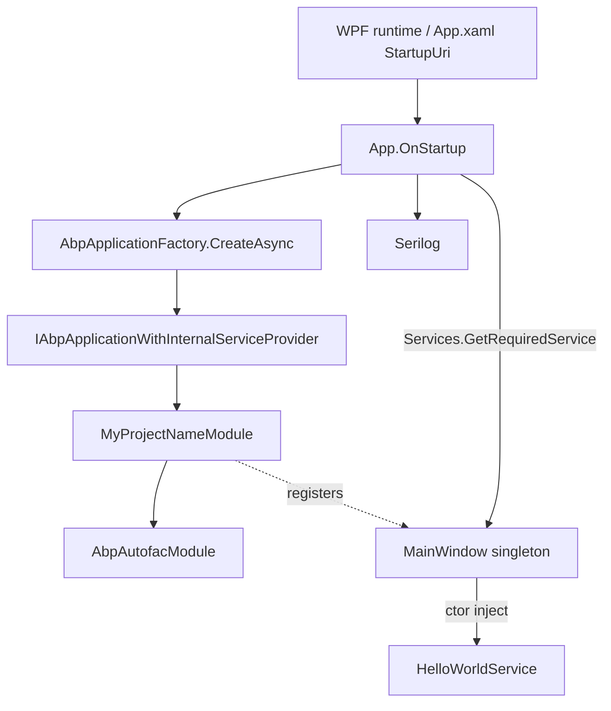

`templates/wpf/` is a **single-project WPF desktop app** wired to ABP. The Application class (`App.xaml.cs`) is the composition root: it builds Serilog, creates an `IAbpApplicationWithInternalServiceProvider`, initialises every loaded module, then resolves `MainWindow` from the container and shows it. On exit it shuts ABP down cleanly.

This is the smallest "ABP everywhere" desktop scaffold — no MVVM toolkit, no localisation, no data access — leaving you to choose the dependencies you want. The composition pattern matches the [`maui`](/templates/maui-template) and [`console`](/templates/console-template) templates: `AbpAutofacModule` + `AbpApplicationFactory`.

## Project tree

```text
templates/wpf/
├── MyCompanyName.MyProjectName.sln
├── common.props
└── src/
    └── MyCompanyName.MyProjectName/
        ├── MyCompanyName.MyProjectName.csproj   # net7.0-windows, UseWPF=true
        ├── App.xaml
        ├── App.xaml.cs                          # ABP bootstrap + Serilog
        ├── MainWindow.xaml
        ├── MainWindow.xaml.cs                   # DI-aware code-behind
        ├── HelloWorldService.cs                 # ITransientDependency demo
        ├── MyProjectNameModule.cs               # The ABP startup module
        ├── AssemblyInfo.cs                      # WPF ThemeInfo
        └── appsettings.json                     # empty {} placeholder
```

Verify with `ls templates/wpf/src/MyCompanyName.MyProjectName/`.

## Composition diagram



The key difference vs. console/MAUI is `IAbpApplicationWithInternalServiceProvider` — WPF does not bring its own DI container, so ABP owns the service provider. The MainWindow is resolved out of ABP's container, not WPF's (there isn't one).

## Key files

### `App.xaml.cs`

The shipped file:

```csharp
public partial class App : Application
{
    private IAbpApplicationWithInternalServiceProvider? _abpApplication;

    protected override async void OnStartup(StartupEventArgs e)
    {
        Log.Logger = new LoggerConfiguration()
#if DEBUG
            .MinimumLevel.Debug()
#else
            .MinimumLevel.Information()
#endif
            .MinimumLevel.Override("Microsoft", LogEventLevel.Information)
            .Enrich.FromLogContext()
            .WriteTo.Async(c => c.File("Logs/logs.txt"))
            .CreateLogger();

        try
        {
            Log.Information("Starting WPF host.");
            _abpApplication = await AbpApplicationFactory.CreateAsync<MyProjectNameModule>(options =>
            {
                options.UseAutofac();
                options.Services.AddLogging(loggingBuilder => loggingBuilder.AddSerilog(dispose: true));
            });

            await _abpApplication.InitializeAsync();
            _abpApplication.Services.GetRequiredService<MainWindow>()?.Show();
        }
        catch (Exception ex)
        {
            Log.Fatal(ex, "Host terminated unexpectedly!");
        }
    }

    protected override async void OnExit(ExitEventArgs e)
    {
        if (_abpApplication != null)
        {
            await _abpApplication.ShutdownAsync();
        }
        Log.CloseAndFlush();
    }
}
```

Notable bits:

- `AbpApplicationFactory.CreateAsync<MyProjectNameModule>(...)` builds the module graph rooted at `MyProjectNameModule` and returns an `IAbpApplicationWithInternalServiceProvider`. `options.UseAutofac()` plugs Autofac into the internal container — without it the demo's constructor injection into `MainWindow` will fail.
- `await _abpApplication.InitializeAsync()` runs the `OnApplicationInitialization(Async)` pipeline.
- `_abpApplication.Services.GetRequiredService<MainWindow>()?.Show()` resolves the window via ABP. The module registers `MainWindow` as a singleton (see below). Notice that `App.xaml` has **no** `StartupUri` — XAML never instantiates the window directly.
- `OnExit` calls `ShutdownAsync` which lets ABP modules drain background workers, dispose scoped services, etc.

### `App.xaml`

Empty `<Application.Resources>`. Notably **no `StartupUri="MainWindow.xaml"`** — the `App` class shows the window manually after ABP resolves it.

```xml
<Application x:Class="MyCompanyName.MyProjectName.App"
             xmlns="http://schemas.microsoft.com/winfx/2006/xaml/presentation"
             xmlns:x="http://schemas.microsoft.com/winfx/2006/xaml"
             xmlns:local="clr-namespace:MyCompanyName.MyProjectName">
    <Application.Resources>
    </Application.Resources>
</Application>
```

### `MyProjectNameModule.cs`

```csharp
[DependsOn(typeof(AbpAutofacModule))]
public class MyProjectNameModule : AbpModule
{
    public override void ConfigureServices(ServiceConfigurationContext context)
    {
        context.Services.AddSingleton<MainWindow>();
    }
}
```

`MainWindow` is explicitly registered as a singleton — this is what enables `_abpApplication.Services.GetRequiredService<MainWindow>()` in `App.OnStartup` to work. Add more `AddSingleton`/`AddTransient` for other windows/pages, or mark their classes with `ISingletonDependency`/`ITransientDependency` for the conventional path.

### `MainWindow.xaml.cs`

Constructor injection straight from ABP:

```csharp
public partial class MainWindow : Window
{
    private readonly HelloWorldService _helloWorldService;

    public MainWindow(HelloWorldService helloWorldService)
    {
        _helloWorldService = helloWorldService;
        InitializeComponent();
    }

    protected override void OnContentRendered(EventArgs e)
    {
        HelloLabel.Content = _helloWorldService.SayHello();
    }
}
```

XAML:

```xml
<Window x:Class="MyCompanyName.MyProjectName.MainWindow"
        Title="MainWindow" Height="450" Width="800">
    <Grid>
        <Label Name="HelloLabel" FontSize="90" Margin="58,129,-58,-129"/>
    </Grid>
</Window>
```

### `HelloWorldService.cs`

```csharp
public class HelloWorldService : ITransientDependency
{
    public ILogger<HelloWorldService> Logger { get; set; } = NullLogger<HelloWorldService>.Instance;

    public string SayHello()
    {
        Logger.LogInformation("Call SayHello");
        return "Hello world!";
    }
}
```

Marked `ITransientDependency` so it is auto-registered by ABP/Autofac. The `Logger` property is property-injected — Autofac will resolve it because ABP's auto-registration scans for `ILogger<>` properties.

### `appsettings.json`

```json
{}
```

Empty stub. There is no embedded resource trick here (unlike MAUI) — WPF apps have a normal working directory, and the csproj copies `appsettings.json` to the output folder via `<CopyToOutputDirectory>Always</CopyToOutputDirectory>`. Add settings keys freely and read them through `IConfiguration`.

### `MyCompanyName.MyProjectName.csproj`

```xml
<Project Sdk="Microsoft.NET.Sdk">
  <Import Project="..\..\common.props" />
  <PropertyGroup>
    <OutputType>WinExe</OutputType>
    <TargetFramework>net7.0-windows</TargetFramework>
    <Nullable>enable</Nullable>
    <UseWPF>true</UseWPF>
  </PropertyGroup>

  <ItemGroup>
    <ProjectReference Include="..\..\..\..\framework\src\Volo.Abp.Autofac\Volo.Abp.Autofac.csproj" />
  </ItemGroup>

  <ItemGroup>
    <PackageReference Include="Microsoft.Extensions.Hosting" Version="7.0.0" />
    <PackageReference Include="Serilog.Extensions.Hosting" Version="4.2.0" />
    <PackageReference Include="Serilog.Extensions.Logging" Version="3.1.0" />
    <PackageReference Include="Serilog.Sinks.Async" Version="1.5.0" />
    <PackageReference Include="Serilog.Sinks.File" Version="5.0.0" />
  </ItemGroup>

  <ItemGroup>
    <None Remove="appsettings.json" />
    <Content Include="appsettings.json">
      <CopyToOutputDirectory>Always</CopyToOutputDirectory>
    </Content>
  </ItemGroup>
</Project>
```

`OutputType=WinExe` makes the build emit a windowed exe with no console. `UseWPF=true` activates the WPF SDK targets.

### `AssemblyInfo.cs`

Standard WPF `[assembly: ThemeInfo(...)]` declaration — leave as is unless you split themes into separate assemblies.

## CLI usage

```bash
abp new Acme.BookStore.Desktop -t wpf
# or
dotnet new abp -t wpf -o ./Acme.BookStore.Desktop
```

No `-u` / `-d` flags apply.

## Post-create checklist

1. **Restore + build** on Windows (WPF cannot be built or run on Linux/macOS):
   ```powershell
   dotnet restore
   dotnet build
   ```
2. **Run:**
   ```powershell
   dotnet run --project src/Acme.BookStore.Desktop
   ```
   Expected: the WPF window opens with "Hello world!" rendered in the giant label. A `Logs/logs.txt` is created next to the binary.
3. **Close the window:** the WPF runtime fires `Application.OnExit`, which awaits `_abpApplication.ShutdownAsync()` and flushes Serilog before the process exits.

## Customisation hot-spots

- **Add more windows.** Register them in `MyProjectNameModule.ConfigureServices` (`context.Services.AddTransient<EditCustomerWindow>()`), then resolve via `_abpApplication.Services` or inject `IServiceProvider` into a navigation service.
- **MVVM.** Add `CommunityToolkit.Mvvm`, derive view-models from `ObservableObject` and register them as `ITransientDependency`. Set the window's `DataContext` from the constructor.
- **HTTP API client.** Add `AbpHttpClientModule` (and the API contracts package from your ABP backend) to `[DependsOn]`. Call `context.Services.AddHttpClientProxies(typeof(MyBackendContractsModule).Assembly)` and configure `RemoteServiceOptions` from `appsettings.json`.
- **Local persistence.** Reference `Microsoft.EntityFrameworkCore.Sqlite` and add a `AbpModule` that registers an `AbpDbContext`. WPF apps that persist to LocalAppData should resolve the path with `Environment.GetFolderPath(SpecialFolder.LocalApplicationData)` and store the connection string in `appsettings.json`.
- **Single-instance enforcement.** Wrap `OnStartup` with a `Mutex` check before calling `AbpApplicationFactory.CreateAsync` so re-launches focus the existing window.
- **Tray apps.** Suppress the main window in `OnStartup` (don't call `.Show()`) and instead show a `System.Windows.Forms.NotifyIcon`. Resolve hidden windows on demand.
- **Auto-update.** WPF apps can be packaged via `dotnet publish -r win-x64 --self-contained` and signed with `signtool`. Place the resulting binaries behind Squirrel/Velopack — ABP doesn't dictate the installer story.

## Lifecycle gotchas

- `App.OnStartup` is `async void` because WPF's API demands it. Any exception inside swallows silently unless caught — the template wraps the whole body in a try/catch that logs via Serilog before continuing. Keep that pattern.
- WPF marshals UI updates onto the dispatcher thread; ABP background workers run on thread-pool threads. Use `Application.Current.Dispatcher.Invoke(...)` when writing to UI controls from ABP services.
- `ShutdownAsync` runs from `OnExit`. If you call `Application.Current.Shutdown()` from anywhere else, ensure it eventually triggers `OnExit` so ABP shuts down — don't kill the process directly.
- `appsettings.json` is loaded with the default `IConfiguration` (built by ABP from current directory + env vars). For deployed Click-Once or MSIX scenarios, ensure `appsettings.json` lands next to the exe and not in `%LOCALAPPDATA%`.

## Source map

| Concept | Path |
|---|---|
| Composition root | `App.xaml.cs` |
| ABP startup module | `MyProjectNameModule.cs` |
| Demo service | `HelloWorldService.cs` |
| Window | `MainWindow.xaml(.cs)` |
| WPF theme registration | `AssemblyInfo.cs` |
| Config | `appsettings.json` |
| `AbpApplicationFactory` | `framework/src/Volo.Abp.Core/Volo/Abp/AbpApplicationFactory.cs` |
| `IAbpApplicationWithInternalServiceProvider` | `framework/src/Volo.Abp.Core/Volo/Abp/IAbpApplicationWithInternalServiceProvider.cs` |
| Autofac integration | `framework/src/Volo.Abp.Autofac/Volo/Abp/Autofac/AbpAutofacModule.cs` |

For the cross-platform sibling see [`maui-template`](/templates/maui-template); for the headless equivalent see [`console-template`](/templates/console-template).
